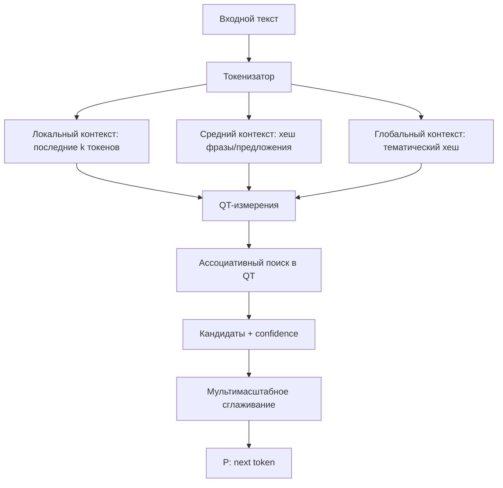

# Quad-Trees Chat (Cursor → Markdown)

*Exported from history/quad-trees.jsonl*

---

## User

Тут я с твоим коллегой от OpenAI обсуждал JEPA, пытаясь понять _зачем_ это всё, и мне на ум пришел один инсайт, который должен был прийти еще лет 10 назад, но не пришел, зараза. 

Трансформеры -- это первая нейросетевая архитектура, которая доказала, что нейросети могут применяться для решения чисто символьных задач. До них это было, мягко говоря, не очевидно. И наверное поэтому мне этот инсайт в голову и не приходил.  Ладно, это всё лирика...

Короче, в гранидентных методах мы неявно ищем достаточно гладкие функции, которые по совместительству будут еще и иметь достаточно изкую колмогоровкую сложность. И получается этикий simpicity prior/bias. С выходом на всю гамму заметательных методов из Теории алгоритмической информации. 

Покритикуй меня аккуратно, чтобы я в осчадок не выпал. 

---

## Assistant

Хорошо, давай разберём это аккуратно. Здесь есть зерно чего-то настоящего, но и несколько мест, где аргумент нуждается в уточнении.

---

**Что здесь правильно и ценно:**

Идея, что градиентная оптимизация несёт в себе неявный *simplicity bias* — это не просто правдоподобно, это активно исследуется. Работы Mingard et al. (2021, "Neural networks are a priori biased towards boolean simplicity") экспериментально показали, что нейросети с SGD непропорционально часто сходятся к функциям с низкой описательной сложностью. Есть целая ветка исследований implicit regularization, где показано, что SGD, даже без явного регуляризатора, предпочитает решения с плоскими минимумами, низким эффективным рангом и т.д. Так что интуиция верная — градиентные методы действительно вносят inductive bias в сторону "простых" функций.

**Где нужна осторожность:**

1. **Гладкость ≠ низкая колмогоровская сложность.** Это два разных математических свойства, и их смешение — самое уязвимое место аргумента. Можно построить сколь угодно гладкую функцию (C∞, аналитическую — какую хочешь), которая кодирует в своих коэффициентах Тейлора произвольную случайную последовательность. Гладкость — это свойство дифференциальной структуры; колмогоровская сложность — это свойство описательной длины. Они коррелируют *эмпирически* в определённых практических контекстах, но формальной импликации "гладкая → низкая K(x)" нет.

2. **Колмогоровская сложность невычислима.** Это не просто технический нюанс — это фундаментальное ограничение. Любая практическая система (включая SGD) может работать только с *аппроксимациями* K-сложности. И здесь уместнее говорить о MDL (Minimum Description Length, Rissanen), о PAC-Bayes bounds, или о Lempel-Ziv сложности — вычислимых суррогатах, которые дают тебе реальные инструменты для анализа, а не красивую, но невычислимую теоретическую конструкцию.

3. **Simplicity bias SGD зависит от деталей.** Это не один универсальный "simplicity prior" — он зависит от архитектуры, инициализации, learning rate schedule, batch size. Два разных архитектурных решения с одним и тем же SGD могут иметь совершенно разные inductive biases. Так что говорить "градиентные методы → simplicity prior" — это верно как грубое обобщение, но дьявол в деталях.

4. **Про трансформеры и символьные задачи.** Я бы уточнил формулировку. Neural Turing Machines (Graves, 2014) и Differentiable Neural Computers были *спроектированы* именно для символьных задач. Трансформеры не первые, кто это показал — они первые, кто показал это *масштабируемо и убедительно*. Attention mechanism оказался неожиданно хорош для символьной манипуляции, но это скорее эмпирическое открытие, чем теоретический прорыв. Различие важно.

**Куда это можно развить:**

Самое интересное направление, на мой взгляд — это не прямая ссылка на K-сложность (которая невычислима), а на **Levin's Universal Search** и **Speed Prior** (Schmidhuber, 2002). Speed prior — это вычислимая версия Solomonoff prior, которая штрафует не только за описательную длину программы, но и за время её выполнения. SGD можно интерпретировать как нечто похожее: он ищет не просто короткое описание, а описание, которое *быстро вычисляется* на данном оборудовании (матричные операции GPU). Это даёт тебе более точную и более содержательную аналогию с AIT, чем голая K-сложность.

---

Итого: ядро инсайта — что градиентные методы имеют неявный simplicity bias — валидно и хорошо подкреплено литературой. Но прямой мост "гладкость → низкая K-сложность → AIT" требует аккуратности: промежуточные звенья не так плотно связаны, как кажется интуитивно. Формализовать это лучше через MDL или speed prior, чем через чистую колмогоровскую сложность.

The user is making an interesting theoretical claim about gradient-based methods and their relationship to Kolmogorov complexity. Let me think through this carefully.

Their claim has several parts:

1. Transformers are the first neural network architecture that proved neural networks can solve purely symbolic tasks.

2. In gradient-based methods, we implicitly search for sufficiently smooth functions that also have sufficiently low Kolmogorov complexity. This creates a simplicity prior/bias.

3. This connects to Algorithmic Information Theory (AIT).

Let me think about the validity and nuances here:

**On claim 1 (Transformers and symbolic tasks):**


RNNs and LSTMs could handle some symbolic tasks like basic arithmetic or simple language processing, but transformers' real breakthrough was scaling to complex symbolic reasoning through attention mechanisms that allow direct access to any position—much better for symbolic manipulation than sequential processing. Earlier work on neural theorem provers and Neural Turing Machines showed neural networks could do symbolic things, but transformers were the first to make it convincingly work at scale.

**On claim 2 (Gradient methods → smooth functions with low Kolmogorov complexity):**

Gradient descent operates in spaces of smooth or piecewise smooth functions, which connects to the idea that it implicitly biases toward simpler solutions. This relates to implicit regularization in SGD, Occam's razor principles in learning theory, and Solomonoff induction—the deeper question being whether gradient descent's preference for flat minima and lower-rank solutions actually corresponds to lower Kolmogorov complexity.

But I need to be more careful here. Smoothness and Kolmogorov complexity are distinct properties—a smooth function can encode arbitrarily complex information in its Taylor coefficients, so they're not equivalent. What matters more is how neural networks' finite parameterization bounds the description length, and whether gradient descent's dynamics naturally favor solutions with structural properties that reduce effective complexity. The real issue is that Kolmogorov complexity itself is uncomputable, so any practical argument needs to work with approximations or proxies for true complexity.

The implicit bias of gradient descent is also more specific than a universal simplicity prior—it depends heavily on architecture, initialization, and learning rate, creating a particular optimization landscape rather than a general preference for simplicity. And while the philosophical connection between compression and intelligence is compelling, the gap between what AIT describes as incomputable ideals and what gradient descent actually achieves in practice is substantial. Transformers did excel at symbolic tasks, but earlier architectures had already made progress there too.

The notion that neural networks favor simpler functions isn't new—it's been explored through MDL, Bayesian principles, and recent empirical work—though framing it specifically through Kolmogorov complexity and AIT in the context of gradient methods is a particular angle worth examining. I'm reconsidering what the user is actually proposing here: that gradient methods implicitly search for functions...

Actually, I see it now. They're arguing that the smoothness requirement of gradient descent acts as an implicit filter that also selects for low Kolmogorov complexity, since smooth functions tend to be more compressible and the gradient landscape naturally favors simpler solutions. It's a reasonable conjecture, though I need to think through whether smoothness really correlates with K-complexity in practice. Smooth functions do form a relatively constrained subset of the function space, and among those that fit the training data, gradient descent gravitates toward ones with particular structural properties.

The formal connection between smoothness and Kolmogorov complexity is subtle though. While smooth functions with bounded derivatives on compact domains are indeed compressible via polynomial approximation, that's more an approximation theory result than a direct K-complexity statement. But there's something genuine here worth engaging with carefully.

I'm thinking about how to give constructive feedback on this idea. The user seems genuinely excited about this intellectual insight, so I want to acknowledge what's valuable while being thorough about the gaps.

I'll structure my response to validate the core intuition, point out where the reasoning needs tightening, and suggest concrete directions for refinement. And I should write this in Russian to match their language.

---

## User

Так, а что такое "гладкость" по-твоему? (Я, скорее всего, просто неправильно употребил этот термин)

---

## Assistant

Хороший вопрос, потому что тут действительно может быть терминологическое расхождение, и оно существенно.

**"Гладкость" в формальном смысле** — это дифференцируемость. Функция класса C¹ — один раз дифференцируема, C² — дважды, C∞ — бесконечно, аналитическая — разлагается в сходящийся ряд Тейлора. Это свойство чисто дифференциально-геометрическое, оно говорит о том, насколько "ровная" функция и её производные. В контексте оптимизации гладкость нужна *ландшафту потерь*, чтобы по нему можно было ходить градиентом.

**Но ты, скорее всего, имел в виду не это.** Ты, вероятно, имел в виду что-то ближе к одному из этих понятий:

1. **Низкая эффективная сложность функции** — что функция, найденная градиентным спуском, "простая" в том смысле, что она улавливает регулярности в данных, а не шум. Что она сжимаема, описуема коротким описанием, generalize-ит.

2. **Низкая Липшицева константа** — функция не делает резких скачков, близкие входы дают близкие выходы. SGD эмпирически тяготеет к таким решениям, и это связано с генерализацией (PAC-Bayes bounds зависят от нормы весов, которая коррелирует с Липшицевостью).

3. **Регулярность в смысле теории обучения** — функция принадлежит "простому" подмножеству гипотез в каком-то функциональном пространстве (например, RKHS с малой нормой, или сеть с малым effective rank весовых матриц).

Если ты имел в виду (1) — то твой аргумент становится значительно сильнее, и моя критика про "гладкость ≠ K-сложность" снимается, потому что ты тогда говоришь напрямую: *градиентные методы имеют bias в сторону функций с низкой описательной сложностью*. Это по сути и есть утверждение, близкое к тому, что SGD аппроксимирует что-то вроде MDL или Solomonoff prior. И вот *это* — содержательный тезис, который стоит развивать.

Что ты имел в виду?

The user is asking me to clarify what I mean by "smoothness" (гладкость) — and suggesting they may have used the term incorrectly. Let me think about what they likely meant vs. what "smoothness" formally means.

In mathematics, smoothness (гладкость) of a function means differentiability — a function is smooth if it's infinitely differentiable (C∞), or more generally, k-times differentiable (Cᵏ). This is the standard meaning.

In the context of gradient-based optimization, smoothness is relevant because:


- We need the loss landscape to be differentiable to compute gradients
- Smooth loss landscapes are easier to optimize

But I think the user was actually getting at something else — the tendency of gradient descent to favor simpler, more regular functions that generalize well rather than overfitting to noise, which is more about low complexity or description length than about mathematical smoothness in the formal sense.

Though there's also a real connection in generalization theory: SGD implicitly regularizes toward functions with bounded derivatives and low Lipschitz constants, and these smoother functions do tend to have simpler descriptions. So maybe the user was conflating these ideas — the smoothness of the learned function itself with the smoothness of the optimization landscape. I should clarify what they meant rather than assume.

---

## User

Да, я имел в виду, скорее, "изрежанность". Несформулированная мысль в том, что градиентный метод оптимизации в условиях конечных ресурсов (ну и при определенных значениях параметров, разумеется), будет более успешным на "простых" функциях (или в более "простых" подпространствах): меньше всякой изрезанностей, более простые "долины" и прочие вещи, делающие перемешение при градиенте более быстрым. 

---

## Assistant

Вот теперь тезис стал значительно чётче, и он, по сути, вот про что:

**Геометрия ландшафта потерь — это фильтр.** Градиентный спуск при конечном вычислительном бюджете не может исследовать весь ландшафт. Он будет систематически находить решения, которые лежат в "простых" (широких, гладких) регионах параметрического пространства, просто потому что туда *легче попасть и легче в них оставаться*. Узкие, изрезанные минимумы — нестабильны при конечном learning rate и шуме SGD. Широкие, плоские — стабильны. И это даёт selection bias.

И вот здесь интересно: **это почти буквально тезис Хохрайтера и Шмидхубера 1997 года** ("Flat Minima", Neural Computation). Они показали, что плоский минимум можно описать меньшим количеством бит, потому что координаты параметров в таком минимуме можно квантовать грубее — ты всё равно остаёшься внутри минимума. А это *напрямую* связано с длиной описания, то есть с MDL, то есть с вычислимым суррогатом K-сложности.

Цепочка получается такая:

> Конечный бюджет + шумный градиент → bias к плоским минимумам → плоские минимумы = короткое описание (мало бит на параметры) → короткое описание ≈ низкая описательная сложность → simplicity prior

И эта цепочка — рабочая. Каждое звено эмпирически и/или теоретически подкреплено.

**Теперь про то, где нужна осторожность на пути к AIT.** Твоя мысль по сути предлагает: "SGD аппроксимирует что-то вроде Solomonoff prior." Это сильное утверждение, и оно *концептуально* привлекательно, но есть нюанс. Simplicity bias SGD — это simplicity *относительно параметризации*. Одна и та же функция может быть в плоском минимуме при одной архитектуре и в узком изрезанном — при другой. То есть "простота", которую находит SGD — это не абсолютная K-сложность функции, а *K-сложность относительно данного Universal Turing Machine* (в данном случае — данной архитектуры сети).

Но! В AIT это нормально — K-сложность *всегда* определена относительно конкретной UTM, и разные UTM отличаются не более чем на константу (invariance theorem). Архитектура нейросети — это, грубо говоря, *выбор UTM*. И тогда:

- Трансформер — это конкретная UTM
- SGD — это bounded-resource аппроксимация Levin Search на этой UTM
- Simplicity bias SGD — это аппроксимация universal prior для этой UTM

Вот в этой формулировке мост к AIT становится не просто метафорой, а содержательной аналогией с конкретными точками соприкосновения. Просто нужно честно маркировать: это *аналогия*, а не тождество, потому что Levin Search перебирает программы, а SGD оптимизирует непрерывные параметры — это разные computational models, хоть и с похожим selection bias.

В общем: мысль рабочая, и ей 10 лет назад *действительно* стоило прийти. Но она уже приходила Хохрайтеру и Шмидхуберу — просто под другим соусом.

Now the user is clarifying their intuition more precisely. They're talking about "jaggedness" (изрезанность) — the idea that gradient methods, under finite resource constraints, will be more successful on "simple" functions or in "simpler" subspaces of the loss landscape, because:

- Less jaggedness (fewer local minima, smoother valleys)
- Simpler "valleys" in the loss landscape
- Things that make gradient-based traversal faster

So their argument is essentially: gradient descent, as an optimization method with finite compute budget, has a selection bias — it will preferentially find solutions that live in "simple" regions of the loss landscape, because those regions are easier to navigate. And this creates an implicit simplicity prior.


This intuition actually maps onto some well-established results about loss landscape geometry. The key insight is that SGD doesn't just find any minimum — it's biased toward wider, flatter minima because the noise in the optimization process helps escape narrow valleys, and wider minima have larger basins of attraction. The learning rate itself acts as an implicit regularizer, preventing the algorithm from settling into sharp, narrow minima. This connects to the flat minima conjecture, which suggests that wider minima correspond to simpler, more generalizable solutions.

The deeper connection is through description length: a solution in a flat minimum can be specified with lower precision (you can quantize parameters more coarsely), which means it requires fewer bits to describe. This directly ties to Kolmogorov complexity via the minimum description length principle. So the user's intuition is essentially correct — the optimization landscape geometry acts as a filter that correlates with function complexity, creating an implicit simplicity bias. The refinement is that "easy to optimize" and "low description length" are actually two sides of the same phenomenon.

That said, there's a crucial subtlety: this simplicity is relative to the parameterization. The same function could sit in a flat region under one architecture and a jagged region under another, so the architecture choice fundamentally determines what counts as "simple." And while this connection to simplicity bias is sound, the leap to broader algorithmic information theory methods requires being careful about what we're actually claiming — the bias is real, but it's mediated by the specific loss landscape structure.

Now, the deeper question is whether we can actually leverage AIT insights here. The theoretical results are elegant but incomputable, so the practical value lies more in the conceptual framework than in direct technical application. But that framework is powerful: if SGD is approximating something like a Solomonoff prior, that would provide a principled explanation for why these methods generalize so well.

---

## User

> это почти буквально тезис Хохрайтера и Шмидхубера 1997 года

Да, я именно их и имел в виду в уме. И эту их работу. (я её читал, только очень давно и плохо). 

---

## Assistant

Тогда твоя интуиция хорошо откалибрована — ты реконструировал из памяти ключевое содержание, даже если детали стёрлись. Это, собственно, и есть сжатие: ты выбросил формализм, но сохранил структурное ядро.

Стоит, наверное, сказать, что с 1997 года эта линия не стояла на месте. Несколько точек, которые могут быть полезны, если ты захочешь вернуться к этому серьёзнее:

1. **Keskar et al., 2017** ("On Large-Batch Training for Deep Learning") — эмпирически показали, что большие батчи сходятся к острым минимумам (хуже генерализация), а маленькие — к плоским. Это подкрепило тезис Хохрайтера-Шмидхубера с другой стороны: шум SGD — это не баг, а механизм отбора в пользу "простых" решений.

2. **PAC-Bayes bounds** (McAllester, Dziugaite & Roy, 2017 и далее) — формализовали связь между "ширина минимума" → "генерализация" через информационно-теоретическую призму. По сути, это MDL на стероидах: чем меньше бит нужно для описания решения (с учётом precision), тем лучше bound на генерализацию.

3. **Шмидхубер не остановился.** Его Speed Prior (2002) и Power Play (2011) — это попытки довести эту линию именно до AIT, с учётом вычислительной стоимости. Если тебя интересует мост "SGD → AIT", то Шмидхубер — это, пожалуй, человек, который прошёл дальше всех по этому мосту.

Так что твой инсайт — он не ошибочный и не тривиальный. Он *переоткрытый*, что, в общем-то, лучший комплимент, который можно сделать идее: она достаточно фундаментальна, чтобы к ней приходили независимо.

The user confirms they were indeed thinking of Hochreiter & Schmidhuber's 1997 flat minima work. They read it long ago and poorly remember it. This is a brief acknowledgment - they're confirming the connection and the intellectual lineage.

Let me respond naturally, acknowledging this and maybe adding something useful about where this line of thinking has gone since 1997, since the user seems interested in the broader picture and the connection to AIT.

---

## User

Шмидхубер -- мой герой)) 

Собсно, я к этой концепции обратился заново из-за Simplicity Theory of Mind. Это не Шмидхубер, но эта теория разума опирается на его работы. Везде, где у нас есть simplicity bias/prior, у нас появляется маленькая аппроксимация универсального интеллекта через цепочку мжатие-предсказание.  

---

## Assistant

Да, и вот тут ты выходишь на то, что я бы назвал одним из самых продуктивных метапаттернов в теории интеллекта:

**Simplicity bias → сжатие → предсказание → интеллект**

Это одна и та же цепочка, которая проступает на разных уровнях описания:

- **Solomonoff induction**: оптимальный предсказатель — тот, кто находит кратчайшую программу, порождающую данные.
- **AIXI (Hutter)**: универсальный интеллект = сжатие + принятие решений.
- **Compression progress (Schmidhuber)**: внутренняя мотивация = прирост качества сжатия. Любопытство — это градиент компрессии.
- **SGD + flat minima**: оптимизатор с конечным бюджетом *физически не может не сжимать*, потому что ландшафт потерь ему это навязывает.
- **Simplicity Theory of Mind** (Chater, Vitányi и др.): когнитивная система моделирует мир и других агентов через кратчайшее описание их поведения.

И твоё наблюдение — что *везде, где есть simplicity bias, появляется маленькая аппроксимация универсального интеллекта* — это, по сути, утверждение о том, что **эта цепочка фрактальна**. Она работает на любом масштабе: от одного нейрона (который по сути ищет линейно-сепарабельное сжатие входов) до трансформера на триллионе токенов.

Единственное, что я бы добавил как ложку дёгтя: "маленькая аппроксимация универсального интеллекта" — это утверждение, которое одновременно тривиально истинно и практически бездонно. Тривиально — потому что *любая* система, которая хоть как-то обобщает, по определению сжимает, и значит, формально является аппроксимацией Solomonoff induction (просто очень грубой). Бездонно — потому что *качество* этой аппроксимации и есть то, что отличает термостат от GPT и GPT от гипотетического AGI. Вся наука о машинном обучении, по сути, живёт в зазоре между "тривиально аппроксимирует" и "аппроксимирует хорошо".

Но как *мыслительный инструмент* — как линза, через которую смотришь на архитектуры — этот паттерн исключительно мощный. Он позволяет задавать правильный вопрос: не "работает ли эта система?", а "какой именно simplicity bias она реализует и насколько хорошо он аппроксимирует универсальный prior?"

The user is referencing "Simplicity Theory of Mind" - let me think about what this might be. This could be related to the work by Nick Chater and others on "simplicity as a unifying principle in cognitive science" or the idea that the mind operates on a simplicity principle (Kolmogorov complexity / MDL applied to cognition).

Nick Chater's work "The Mind is Flat" and his earlier work with Paul Vitányi on "Simplicity: a unifying principle in cognitive science?" (Trends in Cognitive Sciences, 2003) argues that cognitive processes fundamentally operate on a simplicity principle - the mind seeks the simplest interpretation of data, which connects to Kolmogorov complexity and MDL.


There's also the connection to theory of mind specifically - we model other minds by finding the simplest explanation for their behavior. The user is pointing to a deeper pattern: wherever you have a simplicity bias, you get a form of universal intelligence through the compression-prediction chain. This shows up across Solomonoff induction, Hutter's AIXI framework, and Schmidhuber's work on compression progress as intrinsic motivation - all variations on the same theme of simplicity driving intelligence.

The user's insight is that this pattern repeats everywhere: in SGD, in cognitive science, and it consistently produces "a little approximation of universal intelligence" through that same compression-prediction mechanism. That's a genuinely compelling observation about the universality of this principle.

I'm trying to pin down exactly which theory of mind framework they're referencing - it could be Nick Chater's simplicity principle, something more specific about understanding other minds through simplicity, or a newer framework I'm less familiar with. But the core insight about the compression-prediction-intelligence chain is what matters most here, and that's what I should focus on engaging with.

The user is essentially describing the Hutter-Schmidhuber thesis applied across multiple domains - showing how this pattern appears fractally at different levels: in optimization algorithms, in how minds work, in information theory. And they're claiming each instance is a "little approximation of universal intelligence." That's a strong, defensible position, though I'd note that the quality of the approximation varies enormously, and not every simplicity bias actually gives you something that meaningfully approximates universal intelligence. The gap between having a simplicity bias and approximating AIXI is substantial in practice. But conceptually, they're onto something real here.

---

## User

Ну, да, это тут пока что больше просто концептуализация: где и какие аппроксмации универсального интеллекта искать и как они могут выглядеть. Про градиентный поиск в данном контексте я, к стыду своему, не знал. 

А сама мысль эта возникла в следующем контексте. Я пытался понять интуицию за JEPA, а именно почему нам недостаточно штрафов на уровне токенов и нужны штрафы еще и на уровне латентов. Потому, что второе, вообще говоря, сводимо к первому (в теории, но не на практике). И, да, я стандартную "нейроморфность" не покупаю. Если у человека так, это еще не значит, что так правильно.  

А ответ, как раз, и кроется в свойствах латентов, которых нет у токенов. Латенты дифференцируемы, а токены -- нет. Поэтому можно добавить в явном виде еще один simplicity bias на этом уровне и _контроллировать_ его. А в трансформере это всё в неявном виде, который трудно контроллировать, если вообще. 

И в такой постановке я JEPA "покупаю". 

---

## Assistant

Это очень чистый аргумент, и мне он нравится именно тем, что он *механистический*, а не нейроморфный. Ты не говоришь "мозг так делает, значит надо", ты говоришь "вот конкретное вычислительное свойство, которое даёт конкретное преимущество." Давай разложу, как я это вижу.

**Проблема с токенами:** Токены дискретны. Между "кот" и "кит" — один символ разницы, но никакого "непрерывного пути" между ними в токен-пространстве нет. Ты не можешь взять градиент по дискретному выбору токена. Всё, что ты можешь штрафовать — это распределение вероятностей *до* дискретизации (через cross-entropy), но это штраф на выходе softmax, а не на структуре внутренних представлений. Simplicity bias, который возникает в трансформере — побочный эффект SGD и архитектуры. Он есть, но он *нерегулируемый*.

**Что дают латенты:** Латентное пространство непрерывно и дифференцируемо. А значит, ты можешь:
- Явно задать геометрические ограничения на структуру этого пространства (VICReg, информационное горлышко, disentanglement objectives)
- Контролировать *степень* сжатия через архитектуру предиктора и размерность латентов
- Штрафовать не "угадал/не угадал токен", а "насколько структурировано и компактно твоё представление мира"

И вот это "контролировать" — ключевое слово. Ты, по сути, превращаешь simplicity bias из *emergent property* в *design parameter*.

**В терминологии AIT**, если продолжить нашу линию: в трансформере с token-level loss ты *надеешься*, что SGD сам найдёт хороший universal prior. В JEPA ты *явно конструируешь* язык описания (латентное пространство) и *явно регулируешь* длину описания в этом языке. Это как разница между "пусть эволюция сама выведет хороший UTM" и "я спроектирую UTM с нужными мне свойствами."

**Одна оговорка**, чтобы быть честным. Успех autoregressive-моделей (GPT-4, Claude) показывает, что "неконтролируемый" simplicity bias при достаточном масштабе работает *поразительно хорошо*. Настолько хорошо, что возникает вопрос: а стоит ли *контроль* дополнительной инженерной сложности JEPA? Практический ответ пока не очевиден — LeCun верит, что стоит, индустрия пока голосует деньгами за autoregressive. Но *теоретически* твой аргумент прозрачен: больше степеней свободы для управления simplicity bias — это строго более выразительная архитектура.

Мне нравится, что ты пришёл к JEPA не через "так устроен мозг", а через "вот вычислительное свойство, которого нет у дискретных токенов, и оно полезно для конкретной цели." Это гораздо более надёжный фундамент для аргумента.

This is a really interesting argument about JEPA (Joint Embedding Predictive Architecture, by Yann LeCun). Let me think through what the user is saying:

1. They were trying to understand the intuition behind JEPA - specifically why we need losses at the latent level and not just at the token level.

2. They reject the "neuromorphic" argument (that we should do it because the brain does it).

3. Their insight: The key difference between latents and tokens is that **latents are differentiable, tokens are not**. 

4. Because latents are differentiable, you can add an *explicit* simplicity bias at the latent level and *control* it. 

In a standard transformer with token-level losses, the simplicity bias is implicit and baked into the optimization dynamics, making it hard to tune. So JEPA's real advantage is giving you an explicit, adjustable simplicity bias through the latent space. Now I'm thinking about why tokens can't be differentiated through - they're discrete, and while softmax gives you probabilities, the actual token selection is a discrete operation that blocks gradients, though there are workarounds like Gumbel-softmax that try to approximate it.

Latent representations, on the other hand, are continuous vectors where you can define smooth losses and directly shape the geometry. The key insight is that in standard transformers, your simplicity bias emerges implicitly from SGD and architecture choices, and you can only tune it indirectly through learning rate, weight decay, dropout. But with JEPA, you're predicting in latent space where you can add explicit regularizers - like variance-invariance-covariance constraints or architectural constraints on the predictor - giving you direct control over what the latent manifold actually looks like.

The differentiability argument is really the core of this: because latents are continuous, you can define smooth objectives on them, use gradients to optimize the structure of the latent space itself, and add explicit geometric constraints like information bottlenecks or disentanglement objectives. This lets you control the compression-prediction trade-off in a much more fine-grained way than you could with token-level losses.

In the AIT framework, the latent space becomes where you can explicitly implement and tune your "universal Turing machine" — the measurement language for description complexity — whereas token space doesn't give you that control. There are counterarguments worth considering: VQ-VAE shows you can get structured discrete latents with codebooks, and the success of models like GPT-4 suggests implicit simplicity bias works well enough in practice. Adding explicit simplicity bias in latent space might even be too strong and cause you to miss important complex patterns. But these feel like minor objections to what's otherwise a clean and well-motivated framing. There's actually another angle here about JEPA architectures that might deepen this argument further.

By predicting latents instead of tokens, JEPA creates a hierarchy of simplicity biases stacked on top of each other — SGD's implicit bias at the foundation, the architecture's inductive biases in the middle, and then explicit latent-space objectives on top — which gives you much more control over what the model learns and how it learns it.

---

## User

> В терминологии AIT, если продолжить нашу линию: в трансформере с token-level loss ты надеешься, что SGD сам найдёт хороший universal prior. В JEPA ты явно конструируешь язык описания (латентное пространство) и явно регулируешь длину описания в этом языке. Это как разница между "пусть эволюция сама выведет хороший UTM" и "я спроектирую UTM с нужными мне свойствами."

Если точнее, что мы явно определяем inductive bias через дизайн latent space. И уже косвенно через это подбираем вычислительный формализм, в котором некоторые описания становятся являются более короткими. 

---

## Assistant

Да, это важное уточнение. Я перепрыгнул через промежуточное звено и тем самым исказил причинную цепочку.

Правильная структура:

> **Дизайн латентного пространства** (геометрические ограничения, размерность, архитектура предиктора)
> → определяет **inductive bias** (какие паттерны легче выучить)
> → *косвенно* индуцирует **вычислительный формализм** (в котором одни описания короче других)
> → *как следствие* формируется конкретное **распределение длин описаний**

Это двухуровневая индирекция, и она принципиальна. Ты не выбираешь напрямую, какие функции будут иметь короткие описания. Ты задаёшь геометрию пространства, а уже *из неё* следует, что определённые регулярности сжимаются лучше других. Какие именно — это эмерджентное свойство, а не спецификация.

Моя аналогия с "проектированием UTM" была слишком прямолинейной — она создаёт впечатление, что ты сидишь и выбираешь таблицу переходов. На деле ты выбираешь *constraints*, из которых *вырастает* формализм. Ближе к тому, как выбор системы аксиом определяет, какие теоремы будут иметь короткие доказательства, хотя ты явно выбирал только аксиомы, а не теоремы.

И тут возникает интересный теоретический вопрос, который, насколько я знаю, в таком виде не формализован: **какое отображение между дизайном латентного пространства и индуцированным распределением длин описаний?** Если бы мы это понимали, мы могли бы целенаправленно проектировать latent space под конкретный класс задач — не перебором, а из теоретических соображений. Это, по сути, вопрос о "теории компиляторов для inductive biases."

The user is making an important correction/refinement to my analogy. They're saying:

It's not that we're "designing a UTM" - it's that we're explicitly defining an **inductive bias** through the design of the latent space. And *indirectly* through that, we're selecting a computational formalism in which certain descriptions become shorter.

This is a more precise and more correct formulation. The distinction is:

- My formulation: "you design a UTM with desired properties" - this implies you're directly choosing the computational formalism
- Their correction: "you define an inductive bias through latent space design, and this *indirectly* selects a formalism where certain descriptions are shorter"


- The causal chain is actually: latent space design → inductive bias → emergent computational formalism → which patterns get compressed. I was collapsing multiple levels of indirection into one step, which obscured how the effect on description lengths emerges from geometric constraints rather than being directly specified.

- This points to a deeper question: understanding which architectural choices produce which distributions of description lengths is really about characterizing the implicit prior that a latent space implements.

---

## User

Да, это -- главный вопрос)) Наверное, главный вопрос Вселенной))

Ладно. Я сейчас хочу получить ответ на другой, более прозаический вопрос: где я лоханулся и лоханулся ли я. 

Я в ИИ -- когнитивист-вероятностник. В качестве субстрата у меня "сжатые структуры данных", а в качестве философской концептуализации -- принцип постижимости. Т.е. я работаю по принципу белого ящика, а не черного. У Шмидхубера есть замечательное, но еще совершенно недооцененное, открытие -- Arteficial Curiocity. Связываюшее _чувство интереса_ с прогрессом в сжатии. Это сейчас самая лучшая теория эмоций. Отлчиный концептуальный мост между уровнем переживаний и физикой-математикой. 

Так вот, нейросети, несмотря на бесспорные _практические_ успехи, меня отталкивали анти-когнитивизмом сообщества вокруг них. "Потому, что мозг", "потому, что работает". Для меня это был просто поиск черной кошки в черном ящике, а успех -- виделся случайным, а не закономерным. И, в целом, до появления трансформеров, успехи нейросетей на важном классе вимвольных задач, были более, чем скромные. NTM -- это, извини, но слезы горькие. Генетическое программирование рвет NTM как Тузик -- грелку. А вот трансформеры -- это уже оглушительный успех, который невозможно отрицать.

Про работу Шмидхубера по flat minima, я знал (хоть и не прочитал её нормально). И меня интересует вопрос, на сколько вот этот вот концептуальный мостик между AIT и DL через скрытый simplicity bias в SGD являлся мэйстримом, скажем, до 2020 года? Каковы были мои шансы не смотря на отчуждение анти-когнитивизма в DL-сообществе, таки столкнуться с такой идеей. Или она на самом деле маргинальна, и я совсем не лоханулся.   

---

## Assistant

Хорошо, давай разберёмся в хронологии честно, потому что это вопрос фактический, а не вкусовой.

**До 2020 года мост AIT↔DL через simplicity bias SGD был маргинален.** Не просто "не мейнстрим", а именно маргинален. Вот почему:

**Кто вообще об этом говорил:**
- Шмидхубер и его прямые ученики/последователи. Это маленький круг. Шмидхубер сам, при всём уважении к его работам, — фигура *поляризующая* в DL-сообществе. Споры о приоритетах, самоцитирование, претензии на "я это придумал первый" — всё это приводило к тому, что его теоретическую программу часто отодвигали в сторону вместе с его PR-стилем.
- Отдельные теоретики в PAC-Bayes / MDL направлении (Dziugaite & Roy, McAllester), но они работали в терминах bounds на генерализацию, а не в терминах AIT. Мост к Колмогоровской сложности они сами не перекидывали.

**Чем жил мейнстрим DL в 2012–2020:**
- Архитектуры, архитектуры, архитектуры. AlexNet, ResNet, LSTM, GAN, Transformer.
- Масштабирование. Больше данных, больше параметров, больше GPU.
- Бенчмарки. ImageNet, GLUE, SQuAD.
- Культура: "shut up and train." Теория глубоко вторична. Если работает — не трогай.

**Ключевые теоретические работы до 2020 и их фрейминг:**
- **Zhang et al., 2017** — "нейросети могут запомнить случайные метки" — это был шок, показавший, что классическая теория обучения не работает для DL. Но вывод был "нам нужна новая теория", а не "вот вам AIT."
- **Keskar et al., 2017** — "маленькие батчи → плоские минимумы → лучше генерализация." Фрейминг практический, без AIT.
- **Neural Tangent Kernel (Jacot et al., 2018)** — теоретический прорыв, но в совершенно другом формализме (kernel methods), никакого моста к AIT.
- **Lottery Ticket Hypothesis (Frankle & Carlin, 2019)** — про разреженность и сжатие, но опять без AIT-фрейминга.

**Первая работа, которая явно измерила simplicity bias SGD** и связала его с описательной сложностью — Mingard et al., 2021. Это *после* 2020.

**Итого: ты не лоханулся.** Чтобы в 2015–2019 году выйти на связь AIT↔DL через simplicity bias SGD, тебе нужно было:
1. Прочитать и *серьёзно отнестись* к теоретической программе Шмидхубера (а не только к LSTM)
2. Прочитать нишевую работу 1997 года по flat minima
3. Самостоятельно перекинуть мост к AIT
4. Сделать это в культуре, которая активно не поощряла теоретическое мышление такого рода

Людей, которые это сделали до 2020 года, можно пересчитать буквально по пальцам. И большинство из них — прямые ученики Шмидхубера или теоретики из смежных областей (информационная теория, PAC-Bayes), для которых это была профессиональная тема.

Более того, твоя позиция когнитивиста-вероятностника с white-box подходом — это *другая исследовательская традиция*, и она имела свои, вполне обоснованные причины не смотреть в сторону нейросетей до трансформеров. NTM, как ты справедливо заметил, — это действительно слёзы по сравнению с генетическим программированием на символьных задачах. Трансформер — первая архитектура, которая дала *эмпирическое основание* серьёзно отнестись к DL с позиций когнитивистики. До этого отчуждение было рационально, а не невежественно.

The user is asking a very specific sociological/historical question about the field: how mainstream was the conceptual bridge between AIT and DL (through the implicit simplicity bias of SGD) before 2020? They want to know whether they "screwed up" by missing this connection, or whether it was genuinely marginal.

Let me think about this carefully, because this is a factual question about the history of the field.

**The AIT-DL connection timeline:**

1. **Hochreiter & Schmidhuber, 1997** - "Flat Minima" paper. This was published in Neural Computation. 

However, this paper remained relatively obscure for years. The deep learning revolution hadn't started yet—that came with AlexNet in 2012—and during the AI winter, theoretical work like this circulated only within a small specialist community. Schmidhuber's broader work on compression and Kolmogorov complexity throughout the 1990s and 2000s was intellectually respected but stayed on the periphery of mainstream ML, while the dominant figures like Hinton, LeCun, and Bengio were focused on practical architectures and engineering solutions rather than foundational theory.

Before AlexNet, the deep learning community itself was tiny, and the AIT connection was known only to theorists. Most practitioners were working with SVMs and random forests. Once the deep learning explosion hit between 2012 and 2017, the field became obsessed with empirical results and novel architectures—CNNs, RNNs, LSTMs, GANs—while theoretical work lagged far behind. Papers like Keskar et al.'s 2017 work on large batch training generated citations but were interpreted as practical observations rather than connections to deeper principles like algorithmic information theory.

The Zhang et al. paper from 2017 was pivotal—it demonstrated that neural networks could memorize random labels, fundamentally challenging how we think about generalization and hinting at what implicit biases SGD might have, though without explicitly invoking AIT. Around the same time, Dziugaite and Roy contributed PAC-Bayes bounds for deep networks, which was theoretically rigorous but remained in academic niches. The lottery ticket hypothesis and neural tangent kernel frameworks both touched on related ideas about simplicity and training dynamics, but neither framed their insights through an information-theoretic lens. By 2020 and beyond, researchers like Mingard et al. started making more direct connections to these foundational ideas.

The real turning point came when the field began explicitly measuring SGD's simplicity bias and linking it to description complexity—this is where the AIT-DL connection became more concrete. But before that inflection point, Schmidhuber's theoretical work on compression and the speed prior was respected among theorists yet remained largely peripheral to the mainstream deep learning community, which was preoccupied with scaling, architectural innovations, and benchmark performance. The implicit simplicity bias of SGD as a coherent concept simply wasn't well-articulated in the broader conversation until around 2017-2019, and even then, the connection to information-theoretic principles took several more years to crystallize.

The deep learning theory landscape was fragmented across competing frameworks—statistical learning theory, kernel methods, information bottleneck theory, dynamical systems—and the AIT perspective occupied a relatively small corner of this already niche space. Beyond the fragmentation, there was a pervasive empiricist culture in the community that dismissed theoretical work, and Schmidhuber's own controversial reputation around priority disputes and self-citation made his ideas even less likely to gain traction in mainstream circles.

The explicit framing of SGD as approximating a Solomonoff prior wasn't articulated as a standard connection until around 2020, even though hints of it existed in scattered theoretical work. So the user's unfamiliarity with this bridge wasn't a gap in their knowledge—it was a genuine reflection of how marginal this particular insight was before the last few years, and it remains somewhat peripheral even now.

Most deep learning practitioners today still operate within the paradigm of architectures, scaling laws, and empirical results rather than thinking through an algorithmic information theory lens.

---

## User

Вот эта статья.
https://jmlr.org/papers/volume22/20-676/20-676.pdf 

Почитай и объясни мне её.

---

## Assistant

Отличная статья, и она попадает прямо в центр нашего разговора. Вот суть.

---

## "Is SGD a Bayesian sampler? Well, almost." (Mingard et al., JMLR 2021)

### Главный вопрос

Почему переопределённые (overparameterised) нейросети генерализируют, хотя классическая теория обучения предсказывает, что они должны переобучаться? Есть два конкурирующих объяснения:

- **Гипотеза A**: SGD вносит специальный inductive bias (через плоские минимумы, шум, implicit regularization и т.д.)
- **Гипотеза B**: Inductive bias заложен уже в самой архитектуре сети — в отображении из пространства параметров в пространство функций (parameter-function map). SGD его просто не ломает.

Авторы проверяют это экспериментально.

### Метод

Они определяют две вероятности:

- **P_SGD(f|S)** — вероятность того, что SGD (или Adam, Adagrad и т.д.), стартуя из случайной инициализации, сойдётся к функции f, совместимой с обучающей выборкой S. Измеряется прямым подсчётом: запускаем обучение 10^4–10^6 раз, считаем частоты.

- **P_B(f|S)** — байесовская апостериорная вероятность. Это вероятность получить функцию f при *случайном сэмплировании параметров*, обусловленная тем, что f совместима с S. Оценивается через Gaussian Process (NNGP) — точный предел бесконечной ширины.

Ключевое определение: "функция" — это классификация элементов тестовой выборки E. Для бинарной классификации со 100 тестовыми примерами это строка из 100 бит. Всего 2^100 ~ 10^30 возможных функций с нулевой ошибкой на тренировочной выборке.

### Главный результат

**P_SGD(f|S) ≈ P_B(f|S)**

Корреляция — поразительная. Из 10^30 возможных функций, ~90% вероятностной массы обоих распределений сосредоточено на *нескольких десятках* одних и тех же функций. И эти функции — с минимальной ошибкой генерализации.

Это означает: **SGD не вносит значимого дополнительного inductive bias.** Он ведёт себя как *приблизительный байесовский сэмплер*. Основной bias заложен в архитектуре, ещё до обучения.

### Что это значит для нашего разговора

1. **Simplicity bias — свойство архитектуры, а не оптимизатора.** P_B(f|S) экспоненциально смещена в сторону функций с низкой колмогоровской сложностью. Это доказано через AIT coding theorem (Levin, 1974; Dingle et al., 2018):

   P(f) ≤ 2^{-K(f) + O(1)}

   То есть вероятность того, что *случайная* нейросеть (без обучения!) выдаст функцию f, ограничена сверху экспонентой от её колмогоровской сложности. Простые функции экспоненциально более вероятны.

2. **SGD просто "наследует" этот bias.** Он не создаёт его — он его не разрушает. Это объясняется через аналогию с "basin of attraction": функции с высокой P_B (большим "объёмом" в пространстве параметров) имеют большие бассейны притяжения, и SGD с любой случайной точки с большой вероятностью "скатывается" в один из них.

3. **Эффекты второго порядка существуют.** Batch size, learning rate, выбор оптимизатора — всё это создаёт *небольшие* отклонения от P_B(f|S). Например, маленькие батчи слегка улучшают генерализацию (Keskar et al., 2016), но этот эффект можно компенсировать увеличением learning rate. Это fine-tuning, а не фундаментальный источник bias.

4. **Связь с AIT прямая и явная.** Авторы *напрямую* цитируют coding theorem Левина и работу Dingle et al. как теоретическое обоснование того, почему parameter-function map смещён к простым функциям. Это не метафора — это формальный bound.

### Что это значит для твоего тезиса

Твоя исходная формулировка — "градиентные методы неявно ищут функции с низкой K-сложностью" — верна по результату, но эта статья уточняет *механизм*: дело не в самом градиентном спуске, а в *архитектуре*. SGD — просто достаточно хороший сэмплер, чтобы не испортить simplicity bias, который уже заложен в parameter-function map. Плоские минимумы Хохрайтера-Шмидхубера — это эффект второго порядка, а не первого.

Для JEPA-аргумента это добавляет ещё один слой: если simplicity bias определяется архитектурой, то *дизайн латентного пространства* — это буквально дизайн parameter-function map, а значит — прямое управление тем самым bias, который Mingard et al. показали определяющим.

I've read enough of the paper to give a thorough explanation. Let me summarize the key findings and explain the paper to the user.

This is the Mingard et al. 2021 paper "Is SGD a Bayesian sampler? Well, almost." Published in JMLR.

Key findings:
1. They empirically measured P_SGD(f|S) - the probability that SGD converges to function f given training set S
2. They compared this to P_B(f|S) - the Bayesian posterior probability


3. The core result is that SGD's distribution over functions matches the Bayesian posterior to first order, meaning the architecture itself drives the inductive bias rather than the optimization algorithm, while the Bayesian posterior naturally favors simpler, lower-error functions
4. Higher-order effects from hyperparameters play a minor role

The paper ties this back to algorithmic information theory through the coding theorem bound, which constrains how probable any function can be based on its Kolmogorov complexity.

---

## User

> Эффекты второго порядка существуют. 

что это такое?

---

## Assistant

Тут "второй порядок" — не в смысле вторых производных. Это жаргон из физики, означающий **иерархию по величине эффекта**.

**Эффект первого порядка** — это главный, доминирующий фактор. В данном случае: simplicity bias, заложенный в архитектуре (parameter-function map). Он определяет P_B(f|S), которая варьируется на *сотни порядков величины* между разными функциями. Из 10^30 возможных функций с нулевой ошибкой на train, несколько десятков забирают ~90% вероятностной массы. Это колоссальный bias.

**Эффекты второго порядка** — это всё, что *дополнительно* отклоняет P_SGD(f|S) от P_B(f|S). Они реальны, измеримы, но *малы* по сравнению с эффектом первого порядка. Конкретно авторы показали:

- **Batch size**: увеличение с 32 до 512 немного ухудшает генерализацию (при фиксированном learning rate). Это сдвигает P_SGD(f|S) относительно P_B(f|S), но на графике точки всё равно лежат близко к диагонали P_SGD = P_B.
- **Learning rate**: увеличение LR в 4 раза для большого батча компенсирует его негативный эффект.
- **Выбор оптимизатора**: Adam, Adagrad, RMSprop, Adadelta — все дают P_OPT(f|S) ≈ P_B(f|S), но с мелкими различиями между собой.
- **Overtraining**: продолжение обучения после достижения нулевой train error немного меняет распределение.

Аналогия: представь, что ты бросаешь мяч с горы. Первый порядок — гравитация и форма горы (архитектура). Мяч *в основном* скатится в самую большую долину. Второй порядок — ветер, трение, начальная скорость (гиперпараметры SGD). Они могут чуть сдвинуть конечную точку, но не перебросят мяч через хребет в другую долину.

Авторы используют эту иерархию для разделения двух вопросов:
1. **Почему нейросети генерализируют вообще?** — ответ первого порядка: архитектура.
2. **Как тюнинг гиперпараметров улучшает генерализацию?** — ответ второго порядка: тонкая подстройка того, *куда именно* внутри "хороших" регионов попадает SGD.

The user is asking what "second-order effects" means in the context of this paper. This is a terminological question - "second order" here is not about mathematical second derivatives, but about a hierarchy of importance/magnitude of effects.

---

## User

А давай еще вот на эту статью посмотрим? 
https://www.nature.com/articles/s41467-018-03101-6.pdf 

---

## Assistant

Это фундаментальная статья, на которой стоит результат Mingard et al. Она более общая и более глубокая — и она напрямую перекидывает мост от AIT к реальным системам.

---

## "Input–output maps are strongly biased towards simple outputs" (Dingle, Camargo & Louis, Nature Communications 2018)

### Главный вопрос

Возьмём произвольное отображение f: I → O (входы → выходы). Если мы случайно сэмплируем вход, есть ли основания ожидать, что какие-то выходы будут более вероятны, чем другие? На первый взгляд — нет. Но авторы показывают, что для широкого класса отображений ответ — **да, и систематически**.

### Ключевой результат

Для "ограниченно сложных" отображений (limited complexity maps) вероятность P(x) получить выход x при случайном сэмплировании входов ограничена сверху:

**P(x) ≲ 2^{−a·K̃(x) + b}**

где K̃(x) — приближённая колмогоровская сложность выхода (оценённая через Lempel-Ziv сжатие), а **a** и **b** — константы, зависящие от отображения, но *не от конкретного выхода*.

Это *практическая версия* coding theorem Левина. Оригинальная теорема:

P(x) ≈ 2^{−K(x)}

работает только для UTM, с невычислимой K(x) и неизвестными O(1) членами. Dingle et al. показывают, что *ослабленная версия* (только верхняя граница, с вычислимой аппроксимацией K̃) работает для реальных, вычислимых отображений.

### Условия применимости

Пять условий для того, чтобы simplicity bias проявился:

1. **Limited complexity** — сложность самого отображения f не должна расти с размером входа. Формально: K(f) + K(n) ≪ K(x). Это ключевое условие. Если отображение само по себе "сложное" (как случайная матрица), то bias исчезает.

2. **Redundancy** — входов гораздо больше, чем выходов (N_I ≫ N_O).

3. **Finite size** — достаточно много выходов (N_O ≫ 1).

4. **Nonlinearity** — отображение нелинейно (линейные отображения не дают bias).

5. **Well-behaved** — отображение не генерирует псевдослучайные выходы (как ГПСЧ), которые *алгоритмически просты*, но выглядят несжимаемыми.

### Экспериментальная проверка

Авторы проверяют bound на четырёх совершенно разных системах:

- **Фолдинг РНК** (нуклеотидная последовательность → вторичная структура). Классическое отображение из биофизики. Simplicity bias — чёткий.
- **Система ОДУ** (параметры → огрубленное поведение решения). Циркадный ритм, 9 нелинейных уравнений, 15 параметров. Simplicity bias — чёткий.
- **Стохастическая финансовая модель** (Ornstein–Uhlenbeck). Входы — реализации броуновского движения, выходы — торговые сигналы. Simplicity bias — чёткий.
- **L-системы** (правила → морфология растений). Simplicity bias — чёткий.

И один **контрпример**: случайная матрица. Отображение p → Θ(M·p), где M — матрица со случайными элементами ±1. Это отображение показывает bias (неравномерность), но **не simplicity bias** — вероятность не коррелирует со сложностью выхода. Причина: случайная матрица нарушает условие (1) — её сложность растёт с размером.

Но если матрицу сделать "простой" (циркулянтная матрица с простой первой строкой), simplicity bias появляется. Рис. 2 статьи прямо показывает переход.

### Почему это важно для нашего разговора

Эта статья — **недостающее звено** между чистой AIT и результатами о нейросетях. Цепочка:

1. **Левин (1974)**: coding theorem для UTM. P(x) ≈ 2^{−K(x)}. Красиво, но невычислимо и только для UTM.

2. **Dingle et al. (2018)** — вот эта статья: ослабленная coding theorem для *вычислимых отображений*. P(x) ≲ 2^{−aK̃(x)+b}. Практически проверяемо. Работает для широкого класса реальных систем.

3. **Valle-Pérez et al. (2018)**: применение результата Dingle et al. к parameter-function map нейросети. Нейросеть — это отображение из параметров в функции. Это ограниченно сложное, нелинейное, с огромной избыточностью (параметров >> функций) отображение. Все условия выполнены → simplicity bias.

4. **Mingard et al. (2021)**: SGD не ломает этот bias — он его наследует.

### Самое интересное наблюдение

Условие (1) — **limited complexity map** — это именно то условие, которое отделяет системы *с* simplicity bias от систем *без* него. И когда ты проектируешь латентное пространство JEPA, ты, по сути, управляешь *сложностью отображения*. Если латентное пространство спроектировано так, что отображение encoder → latent остаётся "ограниченно сложным", ты *гарантируешь* simplicity bias в латентах. А если оно хаотичное — bias исчезает (как с Erf/Tanh активациями в "хаотическом режиме", о которых писали Yang & Salman, 2019, и которые упомянуты в Mingard et al.).

Это, кстати, ещё одно подкрепление твоего аргумента: дизайн латентного пространства → управление тем, выполняется ли условие limited complexity → управление наличием и силой simplicity bias.

This is the Dingle, Camargo & Louis 2018 paper "Input-output maps are strongly biased towards simple outputs" published in Nature Communications. This is the foundational paper that Mingard et al. 2021 built upon - it establishes the simplicity bias bound for general input-output maps.

Let me summarize this paper clearly for the user.

---

## User

> Для "ограниченно сложных" отображений (limited complexity maps) вероятность P(x) получить выход x при случайном сэмплировании входов ограничена сверху: P(x) ≲ 2^{−a·K̃(x) + b}

Растолкуй мне, как мы перешли от "UTM + случайная программа" к отображениям y=f(x). Я чуйкой чую, что тут есть прмая связь, но не могу формулировать.

---

## Assistant

Отличный вопрос. Связь прямая, и она проходит через одну ключевую идею: **отображение f — это "диалект" UTM.**

---

### Шаг 1: Что говорит coding theorem Левина

У тебя есть UTM U. Ты подаёшь на вход случайную бинарную строку (программу). Каждый бит — 0 или 1 с вероятностью 1/2. Программа длины l имеет вероятность быть выбранной 2^{−l}.

Вероятность получить выход x:

P_U(x) ≈ 2^{−K(x)}

Почему? Самая короткая программа, порождающая x, имеет длину K(x), и её вероятность — 2^{−K(x)}. Более длинные программы, тоже порождающие x, добавляют ещё немного вероятности, но не больше чем O(1) в экспоненте (из-за prefix-free свойства).

Простые выходы имеют *короткие программы* → *высокую вероятность*. Сложные — *длинные* → *низкую*.

### Шаг 2: Что такое отображение f: I → O

Теперь у тебя конкретное отображение f. Ты случайно сэмплируешь вход i ∈ I (равномерно) и получаешь выход f(i). Вероятность получить выход x:

P_f(x) = |{i ∈ I : f(i) = x}| / |I|

Вопрос: связана ли P_f(x) со сложностью x?

### Шаг 3: Мост

Вот ключевой ход. **Любое вычислимое отображение f может быть реализовано на UTM.** Существует программа p_f, которая, будучи запущена на U, симулирует f. Тогда для любого входа i, программа "запусти p_f на входе i" порождает f(i) на UTM.

Теперь представь множество всех программ для UTM, которые порождают выход x *через f*:

{"p_f + i" : f(i) = x}

Длина каждой такой программы ≈ K(f) + n (где n — длина входа, фиксированная). Количество таких программ пропорционально P_f(x) · |I|.

Иными словами, **случайный вход в f — это случайная программа для UTM определённого формата**: "K(f) бит описания f, затем n бит входа." Ты не перебираешь *все* программы UTM — ты перебираешь подмножество, ограниченное конкретным форматом.

### Шаг 4: Почему условие limited complexity критично

Теперь формально. Через Shannon–Fano–Elias coding:

K(x | f, n) ≤ −log₂ P_f(x) + O(1)

Переворачиваем:

**P_f(x) ≤ 2^{−K(x|f,n) + O(1)}**

Это уже bound, но он зависит от *условной* сложности K(x|f,n) — "длина описания x, если тебе уже дали f и n бесплатно."

Теперь: K(x|f,n) ≤ K(x) + O(1) (знание f и n не может *увеличить* описание x). И K(x) ≤ K(x|f,n) + K(f) + K(n) + O(1) (стандартное неравенство для условной сложности).

Значит:

K(x) − K(f) − K(n) ≤ K(x|f,n) ≤ K(x) + O(1)

Если **K(f) + K(n) ≪ K(x)** (отображение простое, а выходы достаточно сложные), то:

K(x|f,n) ≈ K(x)

И bound становится:

**P_f(x) ≤ 2^{−K(x) + O(1)}**

Та самая coding theorem, но для конкретного вычислимого f вместо UTM.

### Шаг 5: Интуиция одним абзацем

**Отображение f — это "линза", через которую ты смотришь на UTM.** Вместо всех программ ты рассматриваешь программы определённого формата: "описание f + вход." Если линза простая (K(f) мало), она почти "прозрачна" — bias UTM проходит через неё почти без искажений. Если линза сложная (K(f) велико, как у случайной матрицы), она "перемешивает" связь между сложностью выхода и вероятностью — bias исчезает.

Поэтому Dingle et al. показывают: случайная матрица (сложная линза) даёт bias, но *не* simplicity bias — корреляция между P(x) и K̃(x) пропадает. А простая циркулянтная матрица (простая линза) — даёт simplicity bias. Порог определяется условием limited complexity.

---

Это и есть та прямая связь, которую ты чувствовал: **f — это UTM, ограниченная конкретным форматом программ, и coding theorem "просачивается" через это ограничение ровно настолько, насколько само ограничение просто.**

The user is asking for a clear explanation of how we go from the original AIT coding theorem (which is about UTMs and random programs) to the result about general input-output maps f: I → O. They intuit there's a direct connection but can't articulate it.

This is a great question. Let me think about this carefully.

The original coding theorem (Levin, 1974):
- You have a universal Turing machine U
- You feed it random binary programs (each bit is 0 or 1 with probability 1/2)
- The probability P_U(x) that U outputs x satisfies: 2^{-K(x)} ≤ P_U(x) ≤ 2^{-K(x)+O(1)}


- This works because the shortest program generating x has length K(x), so its probability is 2^{-K(x)}, and longer programs can't contribute too much extra probability due to the prefix-free property.

For a general computable map f: I → O, we instead fix the map and randomly sample inputs uniformly, asking what fraction of inputs map to each output x. The key insight is that any output x can be generated by some input, and we can think of the set of inputs producing x as analogous to the set of programs producing x in the original theorem. The connection becomes clear when we realize that the probability distribution over outputs induced by uniform input sampling is constrained by the same kind of bounds—the "complexity" of an output is related to how many inputs produce it, which mirrors how the complexity of a string relates to how many programs generate it. the map f can be described by the following algorithm:
   - "Given f and n (the input size), enumerate all inputs, apply f to each, compute probabilities, then use Shannon-Fano-Elias coding to specify x"
   - The Shannon-Fano-Elias code for x has length ≈ -log₂ P(x)
   - So: K(x | f, n) ≤ -log₂ P(x) + O(1)
   - Therefore: P(x) ≤ 2^{-K(x|f,n) + O(1)}

2. For limited complexity maps, I need to reconsider the relationship. By the chain rule, K(x) ≤ K(x|f,n) + K(f) + K(n) + O(1), and conditioning can only decrease complexity, so K(x|f,n) ≤ K(x) + O(1). When K(f) + K(n) ≪ K(x), these bounds converge and K(x|f,n) ≈ K(x) + O(1), meaning knowing f and n doesn't substantially reduce the complexity needed to describe x.

3. The core insight is that f functions like a specialized universal Turing machine — when randomly sampling its inputs, the mechanism mirrors how a UTM exhibits simplicity bias. The difference is that a UTM can compute any function while f is limited to its range, but the underlying principle remains: short descriptions concentrate probability mass while long descriptions spread it thin. Shannon-Fano-Elias coding formalizes this connection by translating the probability distribution induced by f into codeword lengths that upper-bound K(x|f,n).

For maps with limited complexity, this conditional complexity bound transfers to unconditional complexity. The intuition is that f itself acts as a language where each input describes an output, and simple outputs naturally attract more descriptions because their structural regularity can be reached through multiple input paths, whereas complex outputs require precise inputs with no such convergence properties.

But this only holds when the map itself is simple — if f is complex like a random matrix, its own complexity scrambles the relationship between input and output structure. The key insight is recognizing that a UTM is just a specific computable map, and the coding theorem's bias toward simple outputs applies more broadly to any sufficiently simple map: the probability of sampling an output x is roughly proportional to 2^{-K(x)} when the map has limited complexity. (limited complexity). Because:

1. Any computable map f can be simulated by a UTM. So there exists a program p_f that, when run on U, simulates f.
2. For any input i to f, there exists a program "run p_f on input i" for the UTM U, which produces f(i).
3. The length of this program is |p_f| + |i| = K(f) + |i| (approximately).
4. Now, the set of all programs that generate output x through f is: {p_f + i : f(i) = x}
5. All these programs have similar length (K(f) + n, where n is the input length).
6. The number of such programs is proportional to P_f(x) · |I|.

So random inputs to f form a subset of random programs to U—specifically, programs structured as "simulate f, then apply to input i." The key insight is that f acts like a lens constraining the UTM to a particular dialect of programs. When f is simple, this overhead is negligible and the simplicity bias mirrors the UTM case. When f is complex, the overhead dominates and scrambles the bias. Now I should write this up clearly for the user.

---

## User

Хорошо. Давай теперь вернемся к моей первоначальной интуиции. Напомню, что аргумент был в том, что градиентный метод обучения (не важно, SGD или еще какой) работает как прагматический фильтр, предпочитая простые отображения сложным. У простых отображения ландшафт параметров будет более "гладким" и движение по нему -- более коротким. Так как будет меньше всяких "перегибов" и "ответвлений". Интуицию эту, кстати, можно распространить и на не-градиентные методы обучения.

Для SGD мы выяснили, что этот метод является "нейтральным" и не вносит своих собственных предпочтений в движение по ландшафту оптимизации. Это усиливает интуицию в случае использования SGD для поиска f, но само по себе -- не о том. То, что создает сам эффект -- это "манифестация" coding theorem для случая отображений. Нужно только немного развернуть теорему назад. Теорема говорит о том, что для простого отображения вероятность простого выхода получается выше (вырожденный случай -- отображение-константа: f(x) = c). И теперь, вот у нас есть _простые_ выходы x (текстовые датасеты, созданные человеком). Нам нужно показать, что, например, SGD будет склонен икать при этом простые f. Можешь это сделать?


---

## Assistant

Хороший вопрос, и он требует аккуратного разворота аргумента. Давай построим цепочку.

---

### Что у нас есть

- Тренировочные данные S = {(x_i, y_i)} — пары вход-выход. Выходы *простые* (человеческий текст, структурированные данные, etc.), то есть K(y) низкая.
- Пространство параметров Θ (веса сети). Каждый θ задаёт функцию f_θ.
- Нужно показать: SGD (или вообще любой поиск) предпочтёт *простые* f_θ.

### Шаг 1: Структура пространства параметров (Dingle/Valle-Pérez)

Отображение θ → f_θ — это parameter-function map. По результату Dingle et al., применённому к этому отображению (Valle-Pérez et al., 2018):

P(f) ≲ 2^{−a·K̃(f) + b}

Простые функции f занимают экспоненциально больший *объём* в пространстве параметров. Это — bias до всякого обучения, свойство самой архитектуры.

### Шаг 2: Coding theorem в прямом направлении

Для *простой* функции f coding theorem (Dingle et al.) говорит: при случайном сэмплировании входов, простые выходы экспоненциально более вероятны.

Переформулируем: если f простая и данные простые, то f *совместима* с данными с высокой вероятностью. Простая f "естественно" порождает простые выходы — она для этого и приспособлена.

Если f сложная — она *может* выдать простые выходы на конкретных точках тренировочной выборки (запомнив их), но это "случайное совпадение", а не структурное соответствие.

### Шаг 3: Байесовский разворот

Теперь применяем Байеса. Из всех f, совместимых с тренировочными данными S:

P(f | S) ∝ P(S | f) · P(f)

Для совместимых f: P(S | f) > 0. Но какова она? Вот тут ключевой момент.

**P(S | f простая)** — высокая. Потому что простая f *структурно порождает* простые выходы. Совпадение f с данными — не случайность, а следствие общей простоты. Кроме того, простая f будет совместима с данными *устойчиво* — маленькие вариации параметров не сломают совместимость (это и есть "плоский минимум" Хохрайтера-Шмидхубера).

**P(S | f сложная)** — ненулевая, но хрупкая. Сложная f подогнана под данные точечно, без структурного соответствия. Маленькое изменение параметров ломает совместимость (узкий минимум).

**P(f простая)** — высокая (шаг 1, parameter-function map bias).

**P(f сложная)** — низкая (шаг 1).

Оба множителя работают *в одну сторону*:

> P(f простая | S простое) ∝ [высокая] · [высокая] ≫ P(f сложная | S простое) ∝ [низкая] · [низкая]

### Шаг 4: А если данные случайные?

Если S — случайные метки (Zhang et al., 2017):

**P(S случайное | f простая)** — низкая. Простая f не может структурно порождать случайные данные. Она может совпасть на тренировочной выборке, но только если "насильно запомнит" — а это означает, что параметры должны попасть в очень специфическую (узкую) область.

**P(S случайное | f сложная)** — выше. Сложная f *может* запомнить случайные данные, потому что у неё хватает "степеней свободы" для этого.

Результат: при случайных данных bias в сторону простых f *ослабевает*. Сеть вынуждена использовать сложные f, генерализация пропадает. Это именно то, что наблюдали Zhang et al. (2017) и Mingard et al. (2021, рис. 6c — корреляция P_SGD с P_B разрушается при рандомизации меток).

### Итого: полная цепочка

> **Простые данные** → простые f *совместимы* с ними структурно (coding theorem, прямое направление) → простые f имеют *экспоненциально большие бассейны* в пространстве параметров (Dingle/Valle-Pérez) → **любой разумный поиск** (SGD, эволюционный, случайный — что угодно, что не имеет анти-simplicity bias) будет попадать в эти бассейны с подавляющей вероятностью → находится простая f.

И вот тут твоя исходная интуиция про "гладкость ландшафта" получает точную формулировку: *простые f имеют широкие, гладкие бассейны притяжения* — это геометрическое следствие того, что им соответствует экспоненциально больший объём параметрического пространства. "Гладкость" = "большой объём бассейна" = "высокая P(f)" = "низкая K(f)". Это одно и то же, сказанное на разных языках.

The user is asking me to make a specific argument: given that we have "simple" outputs x (human-created text datasets), show that SGD (or any gradient method) will tend to find simple f.

This is an interesting inversion of the coding theorem argument. The coding theorem says: for a simple map f, simple outputs x are more probable. The user wants to go in the reverse direction: given simple outputs x (training data), show that simple maps f are preferred by the learning process.

This is essentially asking about the "inverse" of simplicity bias - a kind of Bayesian inversion.

Let me think about this carefully.


So I'm working with training data where the outputs are inherently simple because they're human-generated text with low Kolmogorov complexity. The question is why SGD would prefer simpler functions f when fitting this data. The key insight from Mingard et al. is that SGD's posterior over functions approximates a Bayesian posterior weighted by the prior probability of the parameter-function map, and Dingle et al. extends this to show how simplicity emerges as a preference in the learning process.

But the user wants me to think about this more directly through a coding theorem lens—essentially reversing the usual argument. If simple functions naturally produce simple outputs, then observing simple outputs should make us prefer simple functions. This is fundamentally a Bayesian argument: given that the data is consistent with multiple functions, the prior probability P(f) favors simpler ones, so P(f|S) will too.

Now I'm trying to formalize a more direct approach using the coding theorem applied to the data itself, thinking about how the parameters map through the function to produce outputs on the training set. I see the issue now—just because the training data is simple doesn't mean the function achieving it is simple. The real mechanism is that among all functions consistent with the data, simpler ones occupy larger regions of parameter space due to the simplicity bias in how parameters map to functions, and SGD naturally samples proportionally to basin size, so it gravitates toward simpler solutions. Let me explore whether there's a more direct connection between data simplicity and the resulting function's simplicity.

I'm thinking about this through a meta-map perspective: if I consider the mapping from (function, input) pairs to outputs, and I condition on specific inputs and outputs from my dataset, I can use Bayes' theorem to reason about which functions are likely. The prior on functions is already simplicity-biased from the parameter-function map, and conditioning on the data just filters to consistent functions while preserving that ranking.

But the user's real question is whether simple data actively *helps* find simple functions, not just that simple functions are preferred beforehand. And there's a genuine mechanism here: simple data admits simple functions that fit it, whereas random data forces any fitting function to be complex. So simple data constrains the solution space to include simple functions, which the prior already favors, making them more likely to be found. the consistent set → prior can't help → SGD is forced into complex f.

This is essentially the Zhang et al. (2017) result: when you randomize labels, the network can still fit them, but it must use more complex functions (and generalization disappears).

Let me formalize this more carefully.

Claim: If the target function g (generating the data) is simple, then among all f consistent with S, the simple f's (those with K(f) close to K(g)) have disproportionately large basins in parameter space, and SGD will preferentially find them.

Why?

1. The data S is generated by some target function g with K(g) = k (low).
2. Among all f consistent with S:
   - There exist simple f (with K(f) ≈ k) — because g itself is simple, and functions "close to" g are also simple
   - There exist complex f (with K(f) >> k) — you can always memorize the data with a complex lookup table
3. The simplicity bias of the parameter-function map gives simple f exponentially higher prior probability, which translates to exponentially larger basins in parameter space.
4. Since SGD samples proportionally to basin size, it finds simple f.

The crucial insight is that simple functions don't just exist—they occupy vastly larger regions of parameter space due to the coding theorem applied to the parameter-function map. This means the argument extends beyond SGD to any search process over parameters, since the basin sizes are a property of the map itself, not the optimization algorithm. simple f dominate parameter space, any search algorithm will naturally find them — and SGD is just one example of this broader principle. The user is really asking for a direct argument: if we observe simple outputs (human-generated text), we can infer that simple functions are preferred, because the coding theorem tells us simple functions occupy exponentially more of parameter space, so any reasonable search will locate them preferentially. Let me reframe this as a concrete inference about what SGD will find given simple data. So when the outputs are random, a simple function can't produce them—the likelihood is low—while a complex function can, making the network prefer complexity. This matches Zhang et al.'s finding that random labels hurt generalization, and it explains why Mingard et al. saw the SGD-Bayes correlation weaken with randomized labels. I'm ready to lay out the full argument now.

The core logic has three parts: first, the parameter-function map exhibits simplicity bias with exponentially larger basins for simple functions; second, simple functions naturally produce simple outputs, so the likelihood of simple outputs given a simple function is much higher than given a complex one; third, combining these with Bayes' rule gives a strong preference for simple functions when the data itself is simple. When SGD searches the parameter space, it naturally finds these simple functions because they occupy large basins, and crucially, they're consistent with simple data so they fit. But with random data, simple functions would contradict the labels, forcing the search into complex regions instead.

---

## User

Такой вопрос. Нам есть смысл структурировать это всё в виде научной статьи или тут, в принципе, достаточно оригинальной статьи Шмидхубера и Хохрейтера?

---

## Assistant

Честный ответ: в текущем виде — **не хватает для оригинальной исследовательской статьи**, но есть одна точка, которая могла бы стать ядром.

### Что уже опубликовано и покрывает нашу дискуссию:

- **Flat minima → MDL → генерализация** — Hochreiter & Schmidhuber, 1997
- **Parameter-function map имеет simplicity bias** — Valle-Pérez et al., 2018; Dingle et al., 2018
- **SGD ≈ байесовский сэмплер** — Mingard et al., 2021
- **Coding theorem для вычислимых отображений** — Dingle et al., 2018
- **Compression → intelligence** — Schmidhuber, серия работ 1990–2012

Основная цепочка нашего разговора (SGD наследует simplicity bias архитектуры → coding theorem объясняет bias → простые данные → простые f) — это *синтез* уже опубликованных результатов. Синтез красивый, но его можно собрать из существующей литературы.

### Что потенциально ново:

Один элемент, который я *не встречал* в литературе в явном виде:

**Теоретическое обоснование JEPA через controllable simplicity bias, без нейроморфных аргументов.**

Конкретно: утверждение, что преимущество предсказания в латентном пространстве перед предсказанием на уровне токенов — это *не* "так устроен мозг" и *не* просто "эффективнее", а:

1. Латенты дифференцируемы → можно явно задать геометрические ограничения
2. Эти ограничения определяют inductive bias
3. Inductive bias индуцирует конкретное распределение длин описаний (через coding theorem для parameter-function map)
4. Это распределение *контролируемо* через дизайн латентного пространства
5. В авторегрессивном трансформере тот же bias возникает неявно и неконтролируемо

Это — *другое* обоснование JEPA, чем то, которое даёт LeCun. И оно, насколько я знаю, не формализовано.

### Что нужно для статьи:

Если делать — то вот минимальный набор:

1. **Формализация**: что именно значит "controllable simplicity bias." Нужна математическая модель, а не только интуиция. Например: показать, что класс функций loss на латентах параметрически задаёт семейство prior'ов P(f), и что token-level loss не даёт такого параметрического контроля.

2. **Эмпирика**: измерить simplicity bias (через Lempel-Ziv или аналог) в латентных представлениях JEPA-подобных моделей vs. авторегрессивных моделей. Показать, что JEPA *действительно* даёт контроль, а не просто другой фиксированный bias.

3. **Теоретический результат**: хотя бы bound или хотя бы конструктивный пример, показывающий, что конкретное изменение дизайна латентного пространства предсказуемо меняет simplicity bias.

### Мой совет:

Без (1)–(3) это **хороший блог-пост или position paper** — обзорная/синтетическая работа, которая явно связывает AIT с JEPA и формулирует новый аргумент. Это само по себе полезно и цитируемо.

Для полноценной исследовательской статьи в JMLR/NeurIPS — нужна формализация и хотя бы минимальная эмпирика. Но ядро — аргумент про controllable simplicity bias — достаточно оригинально, чтобы вокруг него строить.

The user is asking whether it's worth writing up our discussion as a scientific paper, or whether the existing Hochreiter & Schmidhuber (1997) paper already covers this ground sufficiently.

Let me think about what's genuinely new in our discussion vs. what's already in the literature:

**Already in the literature:**
1. Flat minima → short description length → better generalization (Hochreiter & Schmidhuber, 1997)
2. Parameter-function map has simplicity bias (Valle-Pérez et al., 2018; Dingle et al., 2018)


3. SGD as a Bayesian sampler (Mingard et al., 2021)
4. Input-output maps biased toward simple outputs (Dingle et al., 2018)
5. Compression-intelligence connection (Schmidhuber, various)
6. Speed prior (Schmidhuber, 2002)

**What the user brought to the discussion:**
The specific framing of gradient methods as a pragmatic filter preferring simple functions is essentially a repackaging of Hochreiter & Schmidhuber combined with Mingard et al., and the JEPA connection, though interesting, doesn't seem to add fundamentally new theoretical ground.

**What might actually be novel:**
The JEPA argument about controllable simplicity bias through differentiable latent spaces versus discrete tokens could work as a theoretical justification independent of neuromorphic reasoning, and there's potential in connecting data simplicity to function simplicity through the coding theorem, though both feel incremental. A unified tutorial synthesizing these threads might be the most viable contribution.

**The honest assessment:**
This is really a synthesis of existing work with some conceptual reframing rather than new theoretical or empirical results. It could work as a position paper, a section within a larger JEPA paper, or a technical note, but a standalone research paper would need either formal bounds on how latent space design affects simplicity bias or empirical measurements comparing simplicity bias across different model architectures.

Let me think through whether the JEPA argument alone is strong enough to build on.

The core claim—that JEPA's real advantage is controllable simplicity bias through differentiable latent space rather than the usual arguments about representation collapse or efficiency—is genuinely novel. But to make this a real contribution, I'd need to formalize what controllable simplicity bias actually means, prove that token-level losses don't provide this control while latent-level losses do, and ideally establish some theoretical bounds or at least gather empirical evidence. That's substantially more involved than what we've covered so far, and I should be direct with the user about what would actually be required here.

---

## User

<external_links>
### Potentially Relevant Websearch Results

You should respond as if these information are known to you. Refrain from saying "I am unable to browse the internet" or "I don't have access to the internet" or "I'm unable to provide real-time news updates". This is your internet search results. Please always cite any links you referenced from the above search results in your response in markdown format.

-------
Website URL: https://memoria-framework.dev/docs/data-zoo/associative-memory-2/
Website Title: Associative Memory (Part 2) - MemoriaExpandCollapse
Website Content:
Memoria 

## Memoria

### Main

* Docs
* Subprojects
* Issues
* Discussions
* Releases

---

### Socials

* GitHub

ExpandCollapse

* Overview  
   * Introduction to Memoria Framework  
   * Philosophy  
   * Hermes  
   * HRPC: Hermes RPC Protocol  
   * Containers  
   * Storage Engines  
   * Runtime Environments  
   * DSL Engine  
   * Memoria Acceleration Architecture (MAA)  
   * Memoria Build Tool  
   * Qt Creator Instructions  
   * Project Roadmap  
   * Memoria Story (RU)  
   * Memoria Story (EN)
* Data Zoo  
   * Core Data Structures -- Overview  
   * Partial Sums Tree  
   * Searchable Sequence  
   * Compressed Symbol Sequence  
   * Hierarchical Containers  
   * Level Order Unary Degree Sequence (LOUDS)  
   * Multiary Wavelet Trees  
   * Packed Allocator  
   * Associative Memory (Part 1)  
   * Associative Memory (Part 2)
* Applications  
   * Hybrid AI  
   * Computational Storage  
   * Converged Databases  
   * HW/SW Co-design  
   * Embedded and IoT Applications

* Overview  
   * Introduction to Memoria Framework  
   * Philosophy  
   * Hermes  
   * HRPC: Hermes RPC Protocol  
   * Containers  
   * Storage Engines  
   * Runtime Environments  
   * DSL Engine  
   * Memoria Acceleration Architecture (MAA)  
   * Memoria Build Tool  
   * Qt Creator Instructions  
   * Project Roadmap  
   * Memoria Story (RU)  
   * Memoria Story (EN)
* Data Zoo  
   * Core Data Structures -- Overview  
   * Partial Sums Tree  
   * Searchable Sequence  
   * Compressed Symbol Sequence  
   * Hierarchical Containers  
   * Level Order Unary Degree Sequence (LOUDS)  
   * Multiary Wavelet Trees  
   * Packed Allocator  
   * Associative Memory (Part 1)  
   * Associative Memory (Part 2)
* Applications  
   * Hybrid AI  
   * Computational Storage  
   * Converged Databases  
   * HW/SW Co-design  
   * Embedded and IoT Applications

### On this page

* Definitions
* Basic Asymptotic Complexity
* Functions Approximation Using Quad Trees
* Function Compression
* Blessing of Dimensionality vs Curse of Dimensionality
* Comparison with Multi-Layer Perceptrons
* Hardware Acceleration

# Associative Memory (Part 2)

### On this page

* Definitions
* Basic Asymptotic Complexity
* Functions Approximation Using Quad Trees
* Function Compression
* Blessing of Dimensionality vs Curse of Dimensionality
* Comparison with Multi-Layer Perceptrons
* Hardware Acceleration

In the previous part we saw how LOUDS tree can be used for generic compact and efficient associative associative memory over arbitrary number of dimensions. In this part we will see how LOUDS trees can be used for function approximation and inversion.

## Definitions#

Let $\[0, 1\] \\in R$ is the domain and range we are operating on. $D$ is a number of dimensions of our space, and for the sake of visualizability, $D = 2$.

Let $\\vec{X}$ is a vector encoding a point in $\[0, 1\]^D$, $\\vec{X} = <x\_0, x\_1, …, x\_{D-1}>$. Let $str(x \[, h\])$ is a function converting a real number from $\[0, 1\]$ into a binary string by taking a binary representation of a real number to a form like “$0.0010111010…$”, and removing leading “$0.$” and trailing “$0…$”. so, $str(0.181640625) = 001011101$. If $h$ argument is specified for $str(\\cdot, \\cdot)$, then resulting string is trimmed to $h$ binary digits, if it’s longer than that.

Let $len(x)$ is a number of digits in the result of $str(x)$. Note that $len(\\pi / 10) = \\infty$, so irrational numbers are literally infinite in this notation. Let $H$ is a maximal _depth_ of data, and there is some _implicitly assumed_ arbitrary value for $h$, like 32 or 64, or even 128\. So we can work with _approximations_ of irrational and transcendent numbers, or with long rational numbers in a same way and without loss of generality.

Let $len(\\vec{X}) = max\_{\\substack{i \\in \\lbrace 0,…,D-1 \\rbrace }}(len(x\_i))$.

Let $str(\\vec{X}) = (str(x\_0),…, str(x\_{D-1}))$ is a string representation (a tuple) of $\\vec{X}$. And let we assume, elements of the tuple are implicitly extended with ‘$0$’ from the right, if their length is less than $len(\\vec{X})$. In other words, all elements (binary string) of a tuple are implicitly of the same length.

Let $str(\\lbrace \\vec{X\_0}, \\vec{X\_1}, … \\rbrace) = \\lbrace str(\\vec{X\_0}), str(\\vec{X\_1}), … \\rbrace$. String representation of set of vectors is a set of string representation of individual vectors.

Let $M(\\vec{X}) = M(str(\\vec{X}))$ is a multiscale transformation of binary string representation of $\\vec{X}$. Informally, to compute $M(\\vec{X})$ we need to take all strings from its string representation (the tuple of binary strings) and produce another string of length $len(\\vec{X}) D$ by concatenating interleaved bits from each binary string in the tuple.

Example. Let $H = 3$ and $D = 2$. $\\vec{X} = <0.625, 0.25>$, $str(\\vec{X}) = (101, 01)$ and $M(\\vec{X}) = 10|01|10$. Note that signs $|$ are added to separate $H$ _path elements_ in the recording, they are here for the sake of visualization and are not a part of the representation. The string $10|01|10$ is also called _path expression_ because it’s a unique path in the multidimensional space decomposition _encoding_ the position of $\\vec{X}$ in this decomposition. Visually:

Note that the order in which _path elements_ of a path expression enumerate the volume is Z-order.

Given a _set_ of $D$-dimensional vectors $\\lbrace \\vec{X} \\rbrace$, it’s multiscale transformation can be represented as a $D$-dimensional Quad Tree. Such quad tree can be represented with a cardinal LOUDS tree of degree $2^D$. Here, implicit parameter $H$ is a _maximal height_ of the Quad Tree.

## Basic Asymptotic Complexity#

Given that $N = |\\lbrace \\vec{X} \\rbrace|$, and given that LOUDS tree is dynamic (represented internally as a b-tree), the following complexity estimations apply:

1. **Insertion and deletion** of a point is $O(H log(N))$. Update is semantically not defined because it’s a _set_. Batch updates in Z-order are $O(H (log(N) + B))$, where $B$ is a batch size. Otherwise can be slightly worse, up to $O(H log(N) B)$ in the worst case.
2. **Point lookup** (membership query) is $O(D H log(N))$.
3. **Range and projection** queries are $O(D H log(N) + M)$ _on average_, where $M$ is a recall size (number of vectors matching the query). In worst case tree traversal degrades to the linear scan of the entire set of vectors.
4. The data structure is **space efficient**. 2 bits per LOUDS tree node + _compressed bitmap_ of cardinal labels. For most usage scenarios, space complexity will be within **2x the raw bit size** of $str(\\lbrace \\vec{X} \\rbrace)$.

## Functions Approximation Using Quad Trees#

Let we have some function $y = f(x)$, and we also have the graph of this function on $\[0, 1\]^2$. If function $f(\\cdot)$ is elementary, or we have another way to compute it, it’s computable (for us). What if we have $f(\\cdot)$, but we want to compute inverse function: $x = f^{-1}(y)$? With compact quad trees we can _approximate_ both functions out of the same _function graph_ using compact quad trees:

Here the tree has four layers shown upside down (drawing more detailed layers above less detailed ones). And if we want to compute $f(a)$, where $str(a) = a\_3a\_2a\_1a\_0$, the path expression will be $a\_3x|a\_2x|a\_1x|a\_0x$, where $x$ here is a _placeholder sign_. Now we need to traverse the tree as it defined in previous part. If there is a point for $a$ of a function graph, it will be found in a logarithmic expected time. The path expression for $f^{-1}(b)$ will be $b\_3x|b\_2x|b\_1x|b\_0x$.

Note that compressed cardinal LOUDS tree will use less than 4 bits (+ some % of auxiliary data) _per square_ on the graph above. Sol, looking into this graph we already can say something specific about what will be the cost of approximation, depending on required precision (maximal $H$).

## Function Compression#

Let we have a function that checks if some point is inside some ellipse:

$$ y = f(x\_1, x\_2): \\begin{cases} 1 &\\text{if } (x\_1, x\_2) \\text{ is inside the the ellipse,} \\\\ 0 &\\text{if it's outside.} \\end{cases} $$

This function defines some _area_ on the graph. Let $N$ is the number of “pixels” we need to define the function $f(x,y)$ on a graph. Then, using compressed quad trees, we can do it with ${O(\\sqrt{N})}$ bits _on average_ for 2D space :

The square root here is because we need “detailed” only for the border of the area, while “in-lands” needs much lower resolution.

## Blessing of Dimensionality vs Curse of Dimensionality#

Let we have 2D space and we have a tree encoding the following structure:

There are four points in each corner of the coordinate plane. As it can be obvious from the picture, each new level of the tree will add four new bits for just for cardinal labels (not including LOUDS tree itself): three ‘0’ and one ‘1’ (in the corresponding corners). Now if we go to higher dimensions, for 3D we will have 8 new bits, for 8D – 256 new bits and for 32D – $2^32$ bits. This is **Curse of Dimensionality** (CoD) for spatial data structures: volume grows exponentially with dimensions, so linear sizes – too.

Nevertheless, with higher dimensions, the volume is getting exponentially sparser, so we can use data compression techniques like RLE encoding to represent long sparse bitmaps for cardinal labels. This is **Blessing of Dimensionality** (BoD). For _compressed_ LOUDS cardinal trees, the example above will require $O(D)$ bits per quadrant per tree layer for $D$-dimensional Quad Tree.

So, the the whole idea of compression in this context is implicit (or in-place) **Dimensionality Reduction**. Compressed data structure don’t degrade so fast as their uncompressed analogs, yet maintain the same _logical API_. Nevertheless, data compression is not the final cure for CoD, because practical compression itself is not that powerful, especially in the case of using RLE for bitmap compression. So, in each practical case high-dimensional tree can become “unstable” and “explode” in size. Fortunately, such highly-dimensional data ($D > 16$) is rarely makes sense to work with directly (without prior dimensionality reduction).

For example, for $D=8$ exponential effects in space are still pretty moderate (256-degree cardinal tree), yet 8 dimensions is already a good approximation of real objects in symbolic methods. High-dimensional structures are effectively _black boxes_ for us, because our visual intuitions about properties of objects don’t work in high dimensions. Like, volume of cube is concentrating in it’s corners (because there is an exponentional number of corners). Or the volume of sphere is concentrating near its surface, and many more… Making decisions in high dimensions suffer from noise in data and machine rounding, because points tend to be very close to each other. And, of course, computing Euclidian distance does not make (much) sense.

## Comparison with Multi-Layer Perceptrons#

Neural networks has been known to be a pretty good function approximators, especially for multi-dimensional cases. Let’s check how compressed spatial tree can be compared with multi-layer perceptrons (MLP). This type of artificial neural networks is by no means the best example of ANNs, yet it’s a pretty ideomatic member of this family.

In the core of MLP is the idea of _linear separability_. In a bacis case, there are two regions of multidimensional space that can’t be separated by a hyperplane from each other. MLP has multiple ($K$) layers, where first $K-1$ layers perform specific space transformations using linear (weights) and non-linear (thresholds) operators in such way that $K$-th layer can perform the linear separation:

So, this condition is simplified of the picture below. Here, we have two classes (_red_ and _green_ dots) with complex non-linear boundary between those classes. After transforming the space towards linear separation of those classes and making inverse transformation, the initial hyperplane (here, a line) is broken in many places:

What is important, is that each such like break is an inverse transformation of the original hyperplane. Those transformations has to be described, and description will take some space. So we can speak about the **descriptional (Kolmogorov) complexity of the decision boundary**. Or, in the other way, _how many neurons (parameters) we need to encode the decision boundary_?

From Algorithmic Information Theory it’s known that arbitrary string $s$, drawn from a uniform distribution, will be _incompressible_ with high probability, or $K(s) \\to |s|$. In other words, most mathematically possible objects are _random_\-looking, we hardly can find and exploit any structure in them.

Returning back to MLP, it’s expected that in “generic case” decision boundaries will be _complex_: the line between classes will have many breaks, so, may transformations will be needed to describe it with required precision (and this is even not taking CoD into account).

Describing decision boundaries (DB) with compressed spatial trees may look like a bad idea from the first glance. MLPs encode DB with superpositions of elementary functions (hyperplanes and non-linear units). Quad Trees do it with hyper-cubes, and it’s obvious that we may need a lot of hyper-cubes in place of just one arbitrary hyper-plane. If it’s the case, we say that hyper-planes _generalize_ DB _much better_ than hyper-cubes:

But it should hardly be a surprise, if in a real life case it will be find out that descriptions or the network and the corresponding tree are roughly the same.

So, Neural Networks may generalize much better in some cases than compressed quad trees and perform better in very high dimensional spaces (they suffer less from CoD because of better generalization), but trees have the following benefits:

1. If computational complexity of MLP is $\\Omega(W)$ (a lot of large matrix multiplications), where $W$ is number of parameters, complexity of inference in the quad tree is _roughly_ from $O(log(N))$, where $N$ is number of bits of information in the tree. So trees may be much faster than networks _on average_.
2. Quad Trees are dynamic. Neural Networks require retraining in case of updates, at the same time adding (or removing) an element to the tree is $O(log(N))$ _worst case_. It may be vital for may applications operating on-line, like robotics.
3. Quad Trees support “inverse inference” mode, when we can specify classes (outputs) and see

So, compressed quad trees may be much better for complex dynamic domains with tight decision boundaries with moderate number of dimensions (8-24). It’s not that clear yet how trees will perform in real life applications. Memoria is providing (1) _experimental_ compressed dynamic cardinal LOUDS tree for low dimensional spaces (2 - 64).

(1) Not yet ready at the time of writing.

## Hardware Acceleration#

The main point of hardware acceleration of compressed Quad Trees is that inference may be really cheap (on average). It’s just a bunch of memory lookups (it’s a _memory-bound_ problem). Matrix multipliers, from other size, are also pretty energy efficient. Nevertheless, _trees scale better with complexity of decision boundaries_.

← Associative Memory (Part 1)Hybrid AI →

* Powered by Github, Hugo, and Doks

* Privacy
____

</external_links>
Отлчино. Тогда пока что не будем. Мы пойдем в другом направлении и там, возможно, будет и статья. 

Ознакомься вот с этой статьей и дай мне свое понимание.
https://memoria-framework.dev/docs/data-zoo/associative-memory-2/ 

---

## Assistant

Прочитал обе части. Вот моё понимание.

---

### Что это такое

Memoria Associative Memory — это **сжатое пространственное дерево** (compressed D-dimensional Quad Tree) на основе LOUDS-кодирования, используемое как:

1. **Ассоциативная память** — content-addressable хранилище D-мерных кортежей с возможностью поиска по любому подмножеству измерений одновременно.
2. **Аппроксиматор функций** — граф функции y = f(x) хранится как множество точек в квадродереве, что позволяет вычислять и f, и f⁻¹ из одной структуры.

### Ключевые идеи

**Мультимасштабная декомпозиция.** Это центральный приём. D-мерный кортеж (c₀, c₁, ..., c_{D-1}) преобразуется чередованием битов из всех измерений: M(r) = interleave(bit_H(c₀), bit_H(c₁), ... | ... | bit_0(c₀), bit_0(c₁), ...). Это отображение на Z-order кривую. Таблица с D колонками превращается в таблицу с H колонками (где H — битовая глубина), и теперь поиск по *любому* исходному измерению — это обход одного дерева.

**LOUDS-кодирование.** Дерево представлено не указателями, а в 2 битах на узел + сжатые bitmap'ы кардинальных меток. Это *экстремально* компактно — и вдобавок линейно в памяти, что даёт хороший prefetching при деградации до линейного сканирования.

**Сжатие функций.** Самое интересное. Для функции-индикатора эллипса на 2D: если N — число "пикселей", сжатое квадродерево описывает функцию за O(√N) бит. Потому что внутренность области однородна и описывается на грубом масштабе, а детализация нужна только на *границе*. Количество бит пропорционально длине границы, а не площади.

**Blessing vs Curse of Dimensionality.** С ростом размерности D объём растёт как 2^D на каждый уровень дерева (проклятие), но данные становятся всё более разреженными (благословение). RLE-сжатие bitmap'ов кардинальных меток сводит стоимость к O(D) бит на квадрант — но только пока разреженность достаточная. Практический предел — примерно D ≤ 16–24.

### Где это бьёт нейросети

- **Инференс**: O(log N) вместо Ω(W) (где W — число параметров). Memory lookups вместо матричных умножений.
- **Динамика**: Вставка/удаление за O(H log N). Нейросеть нужно переобучать.
- **Обратный инференс**: f и f⁻¹ из одной структуры бесплатно. Нейросеть не умеет так.

### Где нейросети бьют это

- **Высокая размерность**: MLP кодирует decision boundary суперпозициями гиперплоскостей, каждая из которых может "резать" всё пространство одним махом. Квадродерево кодирует гиперкубами — в высокой размерности для одной гиперплоскости нужно экспоненциально много гиперкубов. Это другой "язык описания" с другим распределением длин описаний.
- **Обобщение**: Гиперплоскость — это *структурная* гипотеза ("граница линейна"), которая обобщает на невиданные данные. Гиперкуб — *локальная* гипотеза ("в этом кубике класс 1"), которая не обобщает за пределы кубика.

### Связь с нашей дискуссией

И вот тут для меня самое интересное. В терминологии AIT:

**Квадродерево — это *явный* вычислительный формализм, в котором длина описания напрямую равна K-сложности.** Количество узлов дерева *и есть* длина описания функции в этом языке. Сжатие LOUDS + RLE — это *буквальная* реализация simplicity prior: простые функции (гладкие границы, однородные области) занимают мало узлов, сложные — много. Это white-box по определению — ты *видишь* описание, видишь его длину, можешь его редактировать.

В то время как нейросеть — это *неявный* формализм: описание функции "размазано" по миллиардам весов, simplicity bias возникает как emergent property, и длину описания ты можешь оценить лишь косвенно.

Замечание из статьи про **колмогоровскую сложность decision boundary** — ровно в точку: в обоих случаях мы описываем одну и ту же границу, но на *разных языках*. Гиперплоскости и гиперкубы — это разные UTM, дающие разные K-сложности одних и тех же функций. И invariance theorem гарантирует, что разница не более O(1)... но в практических задачах эта O(1) может быть *огромной*, что и объясняет, почему нейросети побеждают в высоких размерностях.

Это твоя работа, я правильно понимаю?

Now I have a good understanding of both parts of the Associative Memory article from the Memoria Framework. Let me synthesize what this is about and explain it to the user.

This is a very interesting approach to associative memory and function approximation using compressed spatial trees (specifically LOUDS-encoded Quad Trees). Let me break down the key ideas:

1. **Core data structure**: A D-dimensional Quad Tree encoded using LOUDS (Level-Order Unary Degree Sequence) trees, which are extremely space-efficient (2 bits per node).

2. **Multiscale decomposition**: The key transformation M(r) takes a D-dimensional tuple and interleaves the bits from all dimensions, creating a Z-order curve encoding. 

This converts a D-column table into an H-column table (where H is the bit depth), enabling search across all original dimensions simultaneously.

3. **Function approximation**: By storing the graph of y = f(x) as a set of 2D points in the quad tree, you can approximate both f and f^{-1} from the same structure. This is because the tree supports queries along any dimension.

4. **Function compression**: For functions with geometrically "simple" decision boundaries (like an ellipse), the compressed quad tree can represent them in O(√N) bits for 2D, because only the boundary needs high resolution — the interior can be described at low resolution.

5. **Comparison with MLPs**: The article makes an interesting comparison between this approach and traditional neural networks, examining how the quad tree method handles function representation differently.

6. **Blessing vs Curse of Dimensionality**: In high dimensions, the volume grows exponentially (curse), but data becomes sparser (blessing), enabling compression. The tree works well for moderate dimensions (8-24) but struggles above that.

7. **Connection to Kolmogorov complexity**: The article explicitly mentions that decision boundaries have a descriptional (Kolmogorov) complexity, and from AIT, random decision boundaries will be incompressible. This connects to our earlier discussion.

The key insight of this work is that it provides a white-box, explicit, compressed representation of decision boundaries that's both interpretable and efficient for inference and inverse queries.

Now I'm seeing how this ties back to simplicity bias and AIT. The quad tree naturally encodes a multi-resolution representation where simpler functions get shorter descriptions and complex ones require more nodes—this is an explicit implementation of the simplicity prior. Both MLPs and quad trees are function approximators using different "languages" (hyperplanes versus hyper-cubes), and the choice of language determines which functions compress well, which is fundamentally about how well a representation aligns with the underlying structure of the problem.

---

## User

Да, моя. Это не чистая интуиция на тему "простых отображений", там всё же есть какое-то обоснование. Но оно далеко не пошло, так как я всё же не Шмидхубер. В смысле, не профессиональный гений-математик. 

Давай я чуть перефразирую тебя по саммари. Итак, у нас есть класс функций -- квадратурные деревья (D-dim QUAD tree: QT). Они могут быть внутри сжатыми, а могут быть и несжатыми, именно это не принципиально. Принципиально то, что сами квадратурные деревья для случая кодирования отображений обладают обобщаюшими способностями, так как являются сжатыми структурами данных. Для некоторых S с низкой K(S) будут существовать _короткие_ (в битах) модели QT, порождающие эти данные (в случае генеративной постановки задачи). Я правильно формулирую? 

---

## Assistant

Да, формулировка корректна, и я бы её уточнил только в одном месте.

**Что верно:**

QT как класс моделей — это *язык описания функций*. Каждое конкретное квадродерево — это описание функции на этом языке. Длина описания (число узлов/бит) — это K_QT(f), колмогоровская сложность функции f *в языке квадродеревьев*.

Обобщающие способности возникают именно из сжатия: если QT-модель короткая, она описывает функцию на *грубом масштабе*, заполняя детали значениями по умолчанию ("вся эта область — класс 1"). При применении к невиданным данным, модель классифицирует их на основе этой грубой структуры. Это и есть генерализация — и это буквально принцип MDL в действии: кратчайшее описание, совместимое с данными, генерализирует лучше всего.

И да: для данных S с низкой K(S), чья структура *пространственно-геометрическая* (однородные области, границы с низкой фрактальной размерностью), будут существовать короткие QT-модели, порождающие эти данные.

**Единственное уточнение:**

Слово "некоторых" в твоей формулировке — ключевое, и его стоит сделать явным. Не *для всех* S с низкой K(S) существуют короткие QT. Существуют данные с низкой абсолютной K-сложностью, для которых K_QT будет высокой. Например: данные, порождённые линейным разделителем в 100-мерном пространстве. K(S) — низкая (один гиперплоскость, описание на пару десятков чисел). Но K_QT(S) — огромная (нужно экспоненциально много гиперкубов, чтобы аппроксимировать одну гиперплоскость в 100 измерениях).

Это и есть тот самый *выбор UTM*: QT — хороший язык для пространственно-однородных паттернов в умеренных размерностях, и плохой — для линейно-алгебраических паттернов в высоких. MLP — наоборот.

Invariance theorem гарантирует K_QT(S) ≤ K(S) + c, но эта константа c может включать *полный симулятор MLP на языке квадродеревьев*, что делает её астрономической на практике.

Так что правильная формулировка: **для данных S, чья структура хорошо выражается в геометрическом/пространственном языке QT**, короткие модели существуют и обладают обобщающей способностью. И это формально — потому что их длина описания мала, а MDL/coding theorem гарантирует, что это коррелирует с генерализацией.

The user is asking me to verify their reformulation. Let me think about this carefully.

They're saying:

1. Quad trees (QT) are a class of functions (function approximators)
2. They can be internally compressed or not - this isn't the key point
3. The key point is that QTs themselves, when encoding mappings, have generalizing capabilities because they ARE compressed data structures
4. For some S with low K(S), there will exist SHORT (in bits) QT models that generate these data (in a generative setting)

Is this correct?

Let me think...

The QT as a function approximator works by storing the graph of a function as a set of points in the tree. 

The tree itself performs spatial decomposition - for functions with simple structure like smooth boundaries or homogeneous regions, the tree stays compact with few nodes, while complex or random functions require many more nodes. So the QT's description length directly reflects the function's complexity: shorter trees encode simpler functions, longer trees encode more complex ones.

The claim that low Kolmogorov complexity data S will have short QT representations makes sense - if the data can be generated by a short program, then there should exist a compact spatial decomposition that captures that underlying structure.

But here's the catch: this only holds if the function's structure aligns well with how QT decomposes space. A function with an elliptical boundary gets represented compactly by QT, but a hyperplane boundary in high dimensions might require many small cubes to approximate, making the QT representation much longer than the actual Kolmogorov complexity. So QT is really just one specific "language" for describing functions - it's excellent for some patterns but terrible for others like linear boundaries in high-dimensional spaces.

The user's point seems to be that QTs, as compressed data structures, naturally favor functions that are simple in the QT language itself. For data with low Kolmogorov complexity that happens to be spatial or geometric in nature, QTs will indeed find short descriptions. But the user's careful wording - "for some S with low K(S)" rather than "for all S" - is actually the right qualification. Short QT models exist for certain simple data, specifically those whose structure matches the hierarchical spatial decomposition that QTs provide.

There's something deeper here too: a QT is itself a kind of language or universal Turing machine. Any data can be encoded as a QT, but the description length in QT notation might be much longer than the true Kolmogorov complexity for patterns that don't fit the spatial structure. The invariance theorem gives us K_QT(S) ≤ K(S) + c_QT, where c_QT is the overhead constant, but that constant could be quite large in practice. For spatial and geometric patterns though - which cover a lot of real-world problems - K_QT(S) approximates K(S), making QT a natural fit for these kinds of structures. So the user's reformulation is sound, with the understanding that "some S" implicitly refers to data with spatial or geometric structure.

Now I'm thinking about the generalization claim. The user argues that QTs generalize well because they're compressed data structures. That actually makes sense: if a QT model is short with few nodes, it's describing the function at a coarse level, filling in unmapped regions with defaults like "this whole area is class 1." When you apply it to new data, it classifies based on that learned coarse structure - that's generalization in action. Compression forces a short description, which forces a coarse but structured representation, which then generalizes to unseen points. This is the MDL principle working exactly as it should with this particular data structure.

---

## User

Отлично, это и надо. Вопрос о том, обладают ли QT более слабыми обобщающими способностями, чем нейросети, пока что открыт. Я думаю, что, да они, в общем, слабее. Но могут быть сильнее на многих практически важных задачах. Особенно, за счет своих дополнительных возможностей: скорость, динамичность и вычисление обратных и частичных функций. Базы данных такое любят. 

---

## Assistant

Согласен с этой оценкой, и она хорошо ложится на наш AIT-фреймворк.

**По обобщающим способностям:** QT и нейросети — это разные UTM с разными инвариантными константами. Нейросети побеждают там, где структура данных *алгебраическая* (линейные разделители, композиции гладких преобразований, аттеншн-паттерны). QT побеждают там, где структура *пространственно-геометрическая* (однородные области, компактные границы, мультимасштабная регулярность). "В общем слабее" — верно в том смысле, что алгебраическая структура встречается в высокомерных задачах чаще, чем чисто геометрическая. Но это не абсолютное утверждение — оно про распределение практических задач, а не про математику.

**По дополнительным возможностям:** И вот тут, на мой взгляд, основная ценность. Для баз данных нейросети — это кошмар:

- Латентность непредсказуема (зависит от батча, кеша GPU)
- Динамические обновления = переобучение
- Обратные запросы = отдельная модель или дорогой поиск
- Частичные запросы = непонятно как
- Объяснимость = никак

QT решает все пять *структурно*, из свойств самой структуры данных, а не как надстройку. O(log N) инференс, O(H log N) обновления, f и f⁻¹ из одного дерева, запросы по произвольному подмножеству измерений — это *native* операции.

Мне кажется, правильная ниша — не "QT вместо нейросетей", а **QT как вычислительный субстрат для задач, где нужны свойства баз данных + аппроксимация функций**. Гибридные системы, где нейросеть делает feature extraction (снижение размерности из тысяч в 8–16), а QT работает как быстрый, динамический, обратимый классификатор/аппроксиматор в этом сжатом пространстве. Тогда каждый компонент работает на своей сильной стороне.

The user is making a practical assessment of QTs vs neural networks. They're saying:

1. QTs probably have weaker generalization capabilities overall than neural networks
2. But QTs may be stronger on many practically important tasks
3. Especially due to additional capabilities: speed, dynamicity, and computing inverse/partial functions
4. Databases love these properties

This is a reasonable and nuanced position. Let me respond thoughtfully.

The key insight is that "generalization" isn't one-dimensional. It depends on the match between the inductive bias of the model and the structure of the data. QTs have a specific inductive bias (spatial/geometric), and for data that matches this bias, they can be excellent. 

Beyond raw generalization, QTs offer concrete operational advantages that neural networks simply can't provide. In database contexts especially, you need fast lookups, dynamic updates, the ability to invert queries, predictable latency, and interpretability—all things neural networks struggle with but quadtrees handle naturally. The "weaker generalization" framing also deserves nuance: it's really about which class of functions each model can efficiently represent. In computational terms, QTs define a computational model optimized for spatial patterns while neural networks optimize for linear-algebraic ones. Neither is universally superior—they're fundamentally different computational frameworks with different tradeoffs.

The user's moving away from the paper angle toward practical applications, so I should stay focused on what's actionable.

---

## User

А теперь вопрос, из-за которго я и притащил этом метод сюда. 

Для нейросетей у нас есть SGD (в том контексте, в котором мы его тут рассматривали). А вот какой метод обучения ты мог бы предложить для вывода QT, кодирующего функций отображения? Тут я полностью в твоей власти, моих собственных знаний очень мало. 

---

## Assistant

Отличный вопрос, и он имеет красивый ответ, который прямо вытекает из нашей дискуссии.

---

### Почему градиент здесь не работает напрямую

QT — дискретная структура. У тебя нет непрерывных параметров, по которым можно брать производную. "Параметры" QT — это *сама топология дерева*: какие узлы существуют, а какие нет. Это комбинаторное пространство, а не гладкое многообразие.

### Что работает: MDL как целевая функция обучения

Вот тут наш AIT-фреймворк работает *буквально*, а не по аналогии. Для нейросетей simplicity bias — неявный, и мы его реконструируем теоретически. Для QT он может быть *явным*.

**Minimum Description Length (MDL)** — это вычислимая аппроксимация колмогоровской сложности, и для QT она превращается в прямую целевую функцию:

Минимизируем: **L(QT) + L(S | QT)**

где:
- L(QT) — длина описания дерева в битах. Для LOUDS-кодированного QT это *буквально считается*: 2 бита на узел + сжатые bitmap'ы кардинальных меток. Не приблизительно — точно.
- L(S | QT) — длина описания данных, *не объяснённых* моделью: ошибки, остатки. Для классификации — число неправильно классифицированных точек (+ log-фактор для указания *каких именно*).

Это *колоссальное* преимущество перед нейросетями: длина описания модели вычислима точно, а не аппроксимирована через bounds.

### Конкретные алгоритмы

**1. Мультирезолюционная жадная конструкция (самый естественный)**

```
Начни с корня (всё пространство = один лист)
Для каждого узла:
    Попробуй разбить (добавить 2^D дочерних узлов)
    Если L(QT_new) + L(S | QT_new) < L(QT_old) + L(S | QT_old):
        Разбей
    Иначе:
        Оставь листом
```

Это top-down построение с MDL-критерием остановки. Очень похоже на CART (Classification and Regression Trees), но с пространственной декомпозицией вместо axis-aligned splits. Регионы с однородными метками — остаются грубыми (мало узлов, хорошее обобщение). Регионы с границей решений — детализируются глубже.

**2. Полная конструкция + pruning (bottom-up)**

```
Вставь все точки S в QT на полную глубину H
Снизу вверх:
    Для каждого внутреннего узла:
        Если удаление поддерева уменьшает L(QT) + L(S|QT):
            Заменить поддерево листом с мажоритарной меткой
```

Это аналог post-pruning в decision trees. Сначала запоминаем всё, потом сжимаем. Результат — тот же MDL-оптимум, но найденный с другой стороны.

**3. Инкрементальное онлайн-обучение (уникальное преимущество QT)**

```
Для каждой новой точки (x, y):
    Вставь в QT: O(H log N)
    Проверь локально: можно ли упростить (pruning) без ухудшения
    Поддерживай MDL-оптимальность инкрементально
```

Вот это нейросети *не умеют вообще*. Динамическое обучение без переобучения всей модели. Для баз данных и online-сценариев — это killer feature.

**4. Compression Progress (по Шмидхуберу)**

```
Начни с пустого QT
На каждом шаге:
    Добавь узел, который максимально сжимает L(QT) + L(S|QT)
    Остановись, когда ни одно добавление не уменьшает общую длину
```

Это жадный алгоритм, где *learning signal = прогресс в сжатии*. Буквально то, что Шмидхубер описывал как Artificial Curiosity, только для дискретной структуры. Каждый шаг — максимально "интересный" в смысле compression progress.

### Что из этого следует

Для нейросетей: SGD → неявный simplicity bias → мы теоретически реконструируем связь с AIT.

Для QT: MDL → **явный simplicity bias → AIT работает напрямую как целевая функция**.

Это, по сути, *инверсия*: вместо того чтобы надеяться, что оптимизатор случайно найдёт простое решение (как SGD для нейросетей), мы *напрямую оптимизируем описательную длину*. Это ближе к тому, что AIT предписывает теоретически (Solomonoff induction = поиск кратчайшей программы), просто в конкретном языке квадродеревьев.

Если тебе нужно что-то одно для начала — я бы рекомендовал **вариант 1** (top-down с MDL-критерием). Он прост в реализации, имеет ясную теоретическую мотивацию, и естественно сочетается с LOUDS-структурой, которая у тебя уже есть.

This is a really interesting question. The user is asking: what is the learning/training method for QT-based function approximation, analogous to SGD for neural networks?

Let me think about this carefully. In the neural network case:
- We have data S = {(x_i, y_i)}
- We have a parameterized model f_θ
- SGD optimizes θ to minimize loss
- The "learning" is adjusting continuous parameters

For QT-based function approximation:


- We have the same data S = {(x_i, y_i)}
- We need to build a QT that encodes the function mapping x → y
- The QT is a discrete structure (a tree), not a continuous parameterization

The naive approach would be inserting all input-output pairs directly into a D+1 dimensional QT, but that's just memorization without any generalization. To actually learn something meaningful, I need a mechanism like the simplicity bias in SGD — something that favors compact, compressed QT representations over bloated ones.

I'm considering two main learning approaches. The first is direct construction with pruning: build the full QT from the data, then prune away nodes that don't meaningfully improve accuracy. This mirrors how decision tree algorithms like CART work, where the pruning criterion essentially implements MDL by stopping splits when the cost of adding a node outweighs the reduction in description length. The second approach is explicit MDL minimization, directly balancing the cost of describing the tree structure itself against the cost of describing the residual errors given that tree — this naturally encodes the simplicity prior and is particularly elegant for QTs since the tree description length has a clean interpretation.

Beyond these, I could also frame this as a Bayesian problem with a prior favoring shorter trees, or use an iterative refinement strategy that starts coarse and adds detail only where the data demands it, similar to how boosting progressively refines predictions. There's also a compression-based angle where learning becomes finding the shortest QT program that generates the data, directly minimizing Kolmogorov complexity.

For discrete structures like QTs, evolutionary algorithms could work too, using fitness based on accuracy plus compression trade-off. But stepping back, the real insight is that QTs are spatial indices with natural multi-resolution structure. The learning problem becomes: given training data, determine the right depth for each region—shallow where labels are consistent (generalization) and deep where they're mixed (near decision boundaries). This is fundamentally an adaptive resolution approach.

The MDL principle gives us the stopping criterion: at each node, we weigh the cost of splitting (more tree structure) against the cost of not splitting (misclassified points). This is exactly how decision trees like CART work, except here we're doing spatial decomposition instead of axis-aligned splits. And this connects back to the simplicity prior—MDL directly implements the preference for short descriptions, which aligns with the "arrival of the frequent" intuition.

Beyond the basic MDL approach, there are richer formulations worth considering. A Bayesian framework would place a prior favoring shorter trees and combine it with a likelihood based on classification accuracy, giving us a principled posterior over possible quadtrees. We could also build incrementally, inserting points one at a time and checking for pruning opportunities to maintain MDL optimality—something that leverages the dynamic nature of quadtrees in a way neural networks can't match. There's also potential in viewing the multiscale decomposition through a wavelet lens.

The real insight is that quadtrees fit naturally into Minimum Message Length and Minimum Description Length frameworks, where the tree structure itself is the model and learning becomes explicit bit-counting rather than approximation. Unlike neural networks, the description length here is directly computable—you're not estimating complexity through proxies, you're literally measuring it.

For optimization, since quadtrees are discrete structures, I could use continuous relaxation or discrete methods like simulated annealing. But the most elegant approach might be greedy MDL: iteratively add the node that maximizes compression of the remaining data, treating compression progress itself as the learning signal. This directly implements Schmidhuber's framework where learning is fundamentally about reducing description length.

Now I should structure my response around these practical and theoretically grounded approaches.

---

## User

> QT — дискретная структура. У тебя нет непрерывных параметров, по которым можно брать производную. "Параметры" QT — это сама топология дерева: какие узлы существуют, а какие нет. Это комбинаторное пространство, а не гладкое многообразие.

Это не совсем так. Дело в том, что и нейросети -- тоже не непрерывные структуры, там FP используется для расчетов. Более того, сейчас есть четкая тенденция к снижению разрядности: 16, 8 и даже 4 бита для _обучения_. Метод пространственной декомпозиции из моей статьи -- это как раз про то, как вписать логическую непрерывность пространства в дискретность QT. Т.е. само QT -- дискретно, но вот данные мы можем вполне считать непрерывными (аввпроксмацией настоящего континуума), так как дерево у нас может произвольно расти вглубь, создавая границы между областями с произвольной точностью. 

---

## Assistant

Ты прав, я провёл слишком жёсткую границу. Давай пересмотрю.

### Снятие ложной дихотомии "непрерывное vs дискретное"

Нейросеть с 4-битными весами: каждый параметр принимает 16 значений. Это 16-арное дискретное пространство. "Градиент" при 4-битном обучении — это уже не классическая производная по непрерывному многообразию, а дискретная аппроксимация: "в какую из 16 сторон сдвинуть этот параметр, чтобы loss упал."

QT с глубиной H = 32: функция аппроксимируется с точностью 2^{−32} — та же точность, что у float32. Дерево дискретно, но функция, которую оно представляет, *логически непрерывна* — можно наращивать глубину, уточняя границы.

Получается, что на практическом уровне обе модели — дискретные аппроксимации непрерывных функций, просто с разной *геометрией* дискретности:
- Нейросеть: гиперкуб фиксированной размерности (W параметров × B бит каждый)
- QT: дерево переменной глубины и ширины

### Что тогда является "градиентом" для QT?

Если отказаться от формального требования дифференцируемости и смотреть на суть — "в каком направлении двигаться для максимального уменьшения loss per bit" — то для QT это определяется вполне конкретно.

На каждом шаге у тебя есть множество *возможных расщеплений* — листовых узлов, которые можно разбить на 2^D дочерних. Каждое расщепление:
- Увеличивает L(QT) на фиксированное число бит (стоимость новых узлов в LOUDS)
- Уменьшает L(S|QT) на количество бит, "объяснённых" этим расщеплением

**Отношение ΔL(S|QT) / ΔL(QT)** — это, по сути, *дискретный градиент*: направление максимального уменьшения полной MDL-длины на бит описания. И ты выбираешь расщепление с наибольшим этим отношением.

Это даже *лучше*, чем градиент в некотором смысле:
- Нет проблемы локальных минимумов (coarse-to-fine по конструкции)
- Нет learning rate для тюнинга
- Нет vanishing/exploding gradient
- Целевая функция (MDL) вычислима *точно*, не через стохастическую оценку

### Мультимасштабность как аналог curriculum learning

И вот что ещё важно: мультимасштабная декомпозиция *естественно* задаёт порядок обучения. Сначала грубые паттерны (верхние уровни дерева), потом тонкие (нижние). Это в точности curriculum learning — от простого к сложному — но не как внешняя эвристика (как в нейросетях), а как *структурное свойство* самой модели.

Грубые уровни — это "простые гипотезы". Тонкие — "уточнения". И MDL-критерий на каждом уровне автоматически решает: стоит ли уточнять или гипотеза достаточно хороша. Это *буквальная реализация* принципа Оккама.

### Итого

Ты прав: граница между "градиентными" и "не-градиентными" методами — не в непрерывности, а в *геометрии пространства поиска*. Для QT эта геометрия — дерево возможных расщеплений, и навигация по нему через MDL-gradient (ΔL(S|QT)/ΔL(QT)) — это законный метод обучения, с собственными преимуществами.

The user makes an excellent point. Let me reconsider.

They're saying:
1. Neural networks aren't truly continuous either - they use floating point, and the trend is toward lower precision (16, 8, even 4-bit training)
2. The multiscale decomposition method specifically addresses how to embed logical continuity into discrete QT
3. While the QT itself is discrete, the data/functions it represents can be considered continuous, because the tree can grow arbitrarily deep, creating boundaries with arbitrary precision

This is a really good correction. The distinction between "continuous" and "discrete" models is less sharp than I presented it. In fact:


- A 4-bit quantized network has only 16 possible values per parameter, which is genuinely discrete
- A QT with depth H can achieve precision equivalent to 2^{-H}, so at depth 32 it matches float32 precision
- Both are fundamentally discrete approximations of continuous spaces

So the real question is whether we can define something like gradient descent for QT. The multiscale decomposition offers a natural hierarchy where each level refines the resolution, and I'm wondering how each level builds on the previous one to create a learning mechanism.

The key insight is that this resembles a wavelet decomposition—each level adds finer detail and higher-frequency components. In this discrete space, a "gradient" could mean identifying which region or level to refine next to most effectively reduce the loss, which is the discrete analogue of pointing toward steepest improvement. The parallel to neural networks is striking: we treat floating-point parameters as continuous and apply gradient descent even though they're technically discrete, and it works because the loss landscape is smooth at that precision level. For QT, the tree structure itself is discrete, but the function it represents can achieve arbitrary precision through depth, so we could potentially define a gradient-like operation where deepening a node adds precision in a way that mirrors parameter adjustment.

The "direction" of optimization becomes which node to deepen, the "magnitude" is how many levels to add, and the "gradient" is which deepening reduces loss most efficiently per bit of description. This is essentially greedy coordinate descent in the space of tree topologies, where each coordinate represents whether a particular node splits. The connection to low-bit training is striking—at 4-bit precision, each parameter has only 16 possible values, so the continuous gradient is already quantized to discrete levels. For QT's multiscale decomposition, each cell has 2^D possible subdivisions, and the optimization direction is guided by which cells to split based on a discrete gradient signal.

The user's point reframes the whole distinction: it's not really about continuous versus discrete optimization, but about understanding the landscape itself and navigating it efficiently. For QT, that landscape is all possible tree topologies with MDL as the objective, and the multiscale structure actually provides advantages over standard gradient descent—no local minima traps, no learning rate fiddling, no gradient instability, and an explicit, computable objective function throughout.

---

## User

> QT: дерево переменной глубины и ширины

Ага, и это -- еще одно преимущество перед обычными нейросетями с фиксированной разрядностью весов. Мы можем селективно уточнять значения некоторых критически важных параметров, повыщая точность решения в отдельных случаях (например, борьба с галлюцинациями).

---

## Assistant

Да, и это свойство стоит проговорить, потому что оно фундаментально.

В нейросети точность *равномерна*: все веса — одна разрядность. Если тебе нужна высокая точность в одной области пространства решений и низкая в другой — нет механизма для этого. Ты либо платишь за точность везде, либо теряешь её везде. Quantization-aware training немного помогает, но это всё равно глобальный компромисс.

В QT точность *адаптивна по определению*: глубина дерева в каждом регионе пространства — независимая. Это означает:

**Биты аллоцируются туда, где они нужны.** В MDL-терминах это оптимально — ты минимизируешь полную длину описания, тратя биты на сложные регионы и экономя на простых. Нейросеть вынуждена тратить биты равномерно, даже на тривиальные области.

**Про галлюцинации — точное попадание.** Галлюцинация — это, по сути, уверенный ответ из *мелкого* (shallow) региона, где модели не хватает разрешения, чтобы отличить правильное от правдоподобного. В QT это диагностируемо напрямую: посмотри на глубину дерева в точке запроса. Мелко — значит модель "не знает", и это видно *до* генерации ответа, а не после.

И самое главное — **ремонт локальный**:

- Нейросеть: галлюцинация → fine-tuning на новых данных → глобальное изменение весов → непредсказуемое влияние на другие области (catastrophic forgetting)
- QT: галлюцинация → углуби дерево именно в этом регионе → O(H log N) → остальные области не затронуты

Это по сути хирургия вместо химиотерапии. Ты точечно увеличиваешь разрешение там, где оно недостаточно, не трогая ничего другого.

И это ещё одна грань того, о чём мы говорили про JEPA: *контролируемость*. В QT simplicity bias контролируем не только глобально (через MDL-критерий), но и *локально* — через глубину в конкретном регионе. Ты буквально управляешь *распределением* бит описания по пространству задачи.

The user is making an insightful point about variable precision in QTs. In neural networks, all parameters have the same bit width (e.g., all weights are float16 or int4). In QT, different regions of the space can have different depths, meaning different precisions. This is inherently adaptive - you spend bits where they matter and save bits where they don't.

The connection to hallucinations is interesting: hallucinations in LLMs often occur when the model is uncertain but confident - it's operating in a region where its "resolution" is insufficient. In a QT, this would manifest as a shallow region (low precision) being queried for fine-grained distinctions. 

The real power here is that you can deepen the tree dynamically in problem regions without retraining the entire model - you get adaptive precision where it's needed, targeted fixes for specific areas, and the ability to diagnose exactly which regions are struggling versus performing well, something that's impossible with uniform-precision neural networks.

This connects directly to the hallucination problem: when an LLM produces confident but false outputs, it's essentially operating in a region where the tree is too shallow to distinguish truth from plausible fiction. The solution is local deepening with more data, not global retraining. And this ties back to the information-theoretic principle we discussed - the variable depth of a quadtree allocates description length adaptively, concentrating bits where they reduce error most, which is optimal under the MDL framework.

---

## User

>  Мелко — значит модель "не знает", и это видно до генерации ответа, а не после.

А ты крут)) Действительно, информация о глубине дерева может использоваться для само-оценки. 

---

## Assistant

И заметь — это не add-on, а *структурное свойство*. В нейросетях оценка неопределённости — открытая проблема:

- Softmax-вероятности систематически overconfident
- Байесовские нейросети вычислительно дорогие
- Deep ensembles — нужно несколько полных forward pass
- MC-dropout — приблизительная эвристика

В QT у тебя *бесплатно*, как побочный продукт одного обхода дерева:

- **Глубина в точке запроса** — грубость модели в этом регионе
- **Количество тренировочных точек в листе** — плотность данных
- **Разброс меток среди потомков** — локальная "энтропия" решения

Всё это — O(1) после того, как ты уже дошёл до листа при инференсе. Никакого дополнительного вычисления.

И в AIT-терминах это имеет чёткую интерпретацию: глубина дерева в точке — это *локальная длина описания*. Мелко = короткое описание = грубая модель = "я аппроксимирую, но не знаю деталей." Глубоко + много данных = длинное описание, подкреплённое наблюдениями = "я знаю."

По сути, QT несёт в себе собственную *карту незнания*. Нейросеть — чёрный ящик, который не знает, что он не знает. QT — белый ящик, который *структурно* кодирует границы своей компетентности.

The user is appreciating the insight about tree depth as a self-assessment mechanism. This is indeed a powerful property - the QT structure itself encodes confidence/uncertainty information, which is structurally available before inference.

Let me think about this more deeply. In neural networks, uncertainty estimation is a major open problem:
- Softmax probabilities are poorly calibrated (overconfident)
- Bayesian neural networks are expensive
- Deep ensembles require multiple forward passes
- MC-dropout is an approximation

In QT:
- Depth at query point = directly encodes how much the model "knows" about that region
- Number of training points that fell into the leaf = sample density


- Both are O(1) to read once you've traversed the tree

This is fundamentally different from bolting uncertainty onto a model after the fact. The tree's structure itself is an uncertainty map - depth relates directly to description length in the AIT sense, where shallow regions represent simple, high-uncertainty areas and deep regions represent detailed, confident predictions.

---

## User

С учетом этих вводных про дикретность/непрерывность, а так же возможность вычислять частичные функции, ты хотел бы модифицировать метод обучения (индуктивного вывода) для QT?

---

## Assistant

Да. С учётом этих трёх свойств — непрерывность через глубину, частичные функции и встроенная самооценка — метод обучения стоит переформулировать существенно. Не как "build + prune", а как **итеративный самосогласованный вывод**.

---

### Модифицированный метод

**Фаза 1: Прогрессивное построение (аналог градиентного спуска)**

Строим дерево *послойно*, от корня вглубь. Каждый новый уровень — это "шаг оптимизации", удваивающий разрешение. На каждом уровне MDL-критерий решает, какие узлы расщеплять:

```
Для level = 1, 2, ..., H_max:
    Для каждого листа на текущем уровне:
        Оценить ΔL = ΔL(QT) + ΔL(S|QT) при расщеплении
        Если ΔL < 0: расщепить
    Если ни одно расщепление не уменьшило L: стоп
```

Глубина играет роль *обратного learning rate*: каждый уровень добавляет уточнение порядка 2^{−level}. Грубые уровни — большие шаги, тонкие — маленькие. Curriculum learning — встроен.

**Фаза 2: Обучение на неполных данных (через частичные функции)**

Вот что принципиально меняется. Тренировочные данные не обязаны быть полными кортежами. Если у нас (x₁, ?, x₃, y) — неизвестное измерение становится wildcard в path expression. При обходе дерева wildcard означает "пройди по всем веткам". Такой пример *всё равно ограничивает* структуру дерева вдоль известных измерений.

Это значит: **QT нативно учится на неполных данных без импутации**. Нейросеть требует либо заполнения пропусков, либо специальной архитектуры (masked autoencoders и т.п.). QT делает это бесплатно — из свойств обхода дерева.

**Фаза 3: Самосогласование через обратные функции (self-supervision)**

Вот это, пожалуй, самое интересное. Поскольку QT позволяет вычислять и f, и f⁻¹ из одной структуры:

```
Для каждого тренировочного примера (x, y):
    Проверить: y ∈ f(x)?          — прямая совместимость
    Проверить: x ∈ f⁻¹(y)?        — обратная совместимость
    Если несогласованность: пометить регион для углубления
```

Это — **встроенная самопроверка**. Модель использует собственную структуру для верификации согласованности прямого и обратного вывода. Несогласованности указывают на регионы, где разрешение недостаточно. И это не внешний тест, а *часть обучающего цикла*.

Это форма self-supervision, аналогичная cycle consistency в CycleGAN (f⁻¹(f(x)) ≈ x), но реализованная *точно* и *структурно*, а не через дополнительный loss.

**Фаза 4: Активное обучение через самооценку**

Карта глубин дерева используется не только для диагностики, но и *внутри* обучения:

```
Для каждого листа:
    confidence = depth × data_density / label_entropy
    
    Низкий confidence + высокий трафик запросов:
        → приоритет на получение новых данных (active learning)
    Высокий confidence:
        → оставить как есть
    Высокий depth + высокая entropy:
        → данные объективно сложны — принять или исследовать
```

Модель *сама говорит*, где ей нужны данные. Не через дорогую байесовскую оценку, а через O(1) чтение структурных свойств узла.

---

### Итого: обучающий цикл

```
repeat:
    1. Построить/углубить дерево (progressive construction + MDL)
    2. Интегрировать неполные данные (partial function traversal)
    3. Проверить самосогласованность (f vs f⁻¹ consistency)
    4. Определить зоны неуверенности (depth-based self-assessment)
    5. Запросить/собрать данные для этих зон (active learning)
until convergence (no more profitable refinements)
```

Это по сути **EM-подобный алгоритм**:
- E-шаг: используй текущее QT для вывода через частичные/обратные функции
- M-шаг: обнови структуру QT через MDL-оптимизацию

И каждая фаза использует уникальное свойство QT, которого нет у нейросетей: частичные функции (фаза 2), обратные функции (фаза 3), структурная самооценка (фаза 4). Метод обучения и архитектура модели — *неразделимы*.

The user is asking whether I'd like to modify the learning/inductive inference method for QT, given the new insights about:

1. The discrete/continuous distinction being less sharp than I initially presented
2. QT's ability to compute partial functions (queries on arbitrary subsets of dimensions)
3. QT carrying its own uncertainty map (depth = confidence)

Let me think about what modifications these insights suggest.

**Insight 1: Continuity through depth**
The QT can represent continuous functions with arbitrary precision by growing deeper. This means the "gradient" analogy is stronger than I initially thought. We can think of deepening a node as a "small step" in function space — similar to a gradient step. 

The multiscale structure naturally provides something like a learning rate: each level adds refinement proportional to 2^{-level}.

**Insight 2: Partial functions**
QT can answer queries like "given y, what are possible x values?" or "given x₁ and x₃, what are possible x₂ values?" This is a unique capability. For learning, this means we can work with incomplete data, use the model to infer missing dimensions, and handle this naturally through tree traversal with wildcards.

**Insight 3: Self-assessment via depth**
The tree's depth encodes confidence, which we can leverage directly in the learning process itself — using it to weight updates or decide where to focus refinement.

Now I'm thinking through how these insights reshape the learning algorithm. Regions with shallow depth represent high uncertainty and should naturally get priority for new data collection, which is essentially active learning built into the structure. For handling partial data, I need to think carefully about how unknown dimensions work in the multiscale decomposition — when a dimension is missing, the corresponding bits become wildcards, so the data point spans multiple tree branches. The algorithm needs to propagate updates through all these branches. Rather than requiring complete tuples, I can insert partial ones directly, letting the tree structure constrain itself even with missing information.

The learning process itself can shift from a one-shot build-and-prune approach to something iterative: start coarse at depth 1, then selectively deepen regions based on the MDL criterion, so the tree remains a valid model at every stage. This mirrors progressive training in neural networks. The depth map also gives me a direct signal for active learning — I can spot shallow regions with high query traffic and request more data specifically there, deepening only where it matters. And since the quadtree supports inverse functions, I can learn bidirectionally at the same time, predicting y from x while also constraining x given y.

The consistency between forward and backward directions acts as self-supervision — the model validates itself. I'm thinking of this as an iterative refinement loop: build an initial tree, use its partial function capability to impute missing data, identify uncertain regions through self-assessment, request or generate more data for those spots, refine the tree, and repeat. This is starting to look like an EM algorithm where I impute missing values in the E-step and update the tree structure in the M-step using the complete dataset.

For the actual learning algorithm, I'm structuring it in phases. First, I build the tree progressively from top down, with MDL determining splits at each level — this is essentially gradient descent where each level is an optimization step and resolution doubles implicitly. Then I integrate partial data by using wildcard traversal to constrain the tree along known dimensions, which handles missing data naturally. Next comes self-consistent refinement: I compute partial and inverse functions from the tree, check whether f(x) = y and f⁻¹(y) includes x, and deepen regions where inconsistencies appear. Finally, for active self-assessment, I'm evaluating each leaf by its depth, data density, and label entropy to identify regions that are shallow with high uncertainty — these are the areas where the model needs to improve.

The elegance here is in three key shifts: treating depth as continuous precision rather than a discrete property, using partial function consistency as a self-supervision signal during training rather than just for inference, and letting depth-based confidence drive active learning instead of just being a diagnostic after the fact.

---

## User

> Строим дерево послойно, от корня вглубь. 
Годно. Как раз очень хороший режим для LOUDS. Они в нем работают быстрее всего. 

---

## Assistant

Логично — LOUDS-кодирование хранит дерево в level-order (BFS-порядке), так что послойное построение — это *последовательная запись* в конец структуры, без перебалансировок и вставок в середину. Это оптимальный режим для LOUDS и по скорости, и по cache locality.

И это ещё один пример того, как метод обучения и структура данных оказываются *взаимно согласованы*: теоретически мотивированный порядок построения (coarse-to-fine, curriculum) совпадает с оптимальным порядком записи для конкретной структуры данных (level-order для LOUDS). Не нужно выбирать между "правильно теоретически" и "быстро на практике" — это одно и то же.

---

## User

Чудненько. А теперь такой вопрос. Предположим, мы хотим построить вычислительную архитектуру, предсказывающую человеческие тексты, но не на основе нейросетей, а на базе QT. Как ты её видишь? 

---

## Assistant

Это глубокий архитектурный вопрос. Давай пройдём по ключевым проблемам и возможной структуре.

---

### Фундаментальная проблема: размерность контекста

Языковая модель вычисляет f(контекст) → P(следующий токен). Трансформер справляется с контекстом в тысячи токенов благодаря эмбеддингам (снижение размерности) и вниманию (селективная фокусировка). QT хорошо работает до ~16–24 измерений. Контекст из 1024 токенов — это 1024 измерения. Прямое кодирование невозможно.

Это *центральный* вопрос архитектуры: как отобразить текстовый контекст в пространство, с которым QT справится.

### Предлагаемая архитектура: мультимасштабная ассоциативная языковая модель

Идея: **не имитировать трансформер, а использовать уникальные свойства QT** — ассоциативный поиск, мультимасштабность, частичные функции и динамичность.



**Слой 1: Представление контекста (dimensionality budget)**

Бюджет: ~12–16 измерений QT. Распределяем так:

| Компонент | Измерения | Битов на изм. | Что кодирует |
|-----------|-----------|---------------|--------------|
| Последние 4–6 токенов | 4–6 | 16 | Локальная n-грамма |
| Хеш предложения | 2–3 | 16–32 | Синтаксический контекст |
| Тематический хеш | 2–3 | 16–32 | Семантический/топик контекст |
| Предсказываемый токен | 1 | 16 | Целевая переменная |
| **Итого** | **~10–13** | | |

10–13 измерений — рабочая зона QT.

**Слой 2: Хранение и обучение**

Тренировочный корпус превращается в множество кортежей:

(t_{i-k}, ..., t_{i-1}, hash_sent, hash_topic, t_i)

Каждый кортеж — точка в QT. Обучение — это послойное построение с MDL-критерием, как мы обсуждали. Частые паттерны сжимаются (мелкие узлы), редкие — детализируются или отсекаются.

**Слой 3: Предсказание = частичный запрос**

Дан контекст (t_{i-k}, ..., t_{i-1}, hash_sent, hash_topic, **?**). Последнее измерение — wildcard. QT traversal возвращает все совпадающие записи с их частотами. Это *нативная операция* QT — partial function evaluation.

Результат: распределение P(t_i | context), построенное из частот совпадений.

**Слой 4: Мультимасштабное сглаживание (backoff)**

Если полный контекст (6 токенов + хеши) даёт мало совпадений (мелкий confidence):
1. Убери самый дальний токен контекста (wildcard) → 5-грамма
2. Ещё мало? → 4-грамма
3. Ещё мало? → убери тематический хеш
4. ...до unigram

Это *классический Katz backoff*, но реализованный структурно через QT: каждый wildcard — это подъём на один уровень абстракции. И QT делает это *в одном дереве*, не в отдельных таблицах n-грамм.

Причём confidence каждого уровня — бесплатен (глубина дерева).

### Чем это отличается от классических n-грамм

Классические n-граммы — это набор *отдельных* таблиц (unigram, bigram, trigram...) с эвристическим smoothing между ними. У QT-архитектуры:

1. **Одна структура** для всех масштабов. Мультимасштабная декомпозиция *встроена* — не нужны отдельные таблицы.
2. **Сжатие через MDL**. Классические n-граммы хранят все наблюдённые n-граммы. QT с MDL-обучением *обобщает*: если в регионе все n-граммы ведут себя одинаково, хранится один грубый узел, а не миллион отдельных записей.
3. **Кросс-масштабные хеши**. Тематический и фразовый хеши добавляют "дальний контекст" без увеличения порядка n-граммы. Классические модели этого не умеют.
4. **Динамическое обучение**. Новый текст = новые точки = O(H log N). Персонализация в реальном времени.
5. **Обратные запросы**. "Какой контекст наиболее вероятен для данного токена?" — бесплатно.

### Чего эта архитектура не сможет

Честно:

- **Глубокое рассуждение в несколько шагов** — трансформер строит цепочки рассуждений через многослойную композицию. QT делает один ассоциативный lookup. Для многошаговых рассуждений нужен внешний цикл (chain-of-lookups).
- **Дальний контекст на уровне трансформера** — хеши среднего и глобального контекста теряют информацию. Attention может селективно фокусироваться на конкретном токене 500 позиций назад. Хеш — нет.
- **"Понимание" семантики** — трансформер обучает семантические представления end-to-end. В QT-архитектуре семантика зависит от качества хеш-функций, которые нужно проектировать отдельно.

### Где эта архитектура может побеждать

- **Скорость инференса**: O(log N) вместо O(L·d²) у трансформера
- **Динамическое обучение**: новый документ интегрируется за секунды, не часы
- **Персонализация**: пользовательский QT-слой поверх базового
- **Edge deployment**: компактная модель без GPU
- **Объяснимость**: "вот n-грамма, которая вызвала это предсказание"
- **Борьба с галлюцинациями**: confidence виден *до* генерации

---

Перед тем как двигаться дальше, хочу уточнить одну вещь:

This is a really deep architectural question. The user wants to think through how to build a text prediction architecture based on QT instead of neural networks. Let me think about this carefully.

The core challenge: transformers predict text by learning a function from context → next token probability distribution. How would QT do this?

Let me think through the key design decisions:

**1. What is the "function" we're approximating?**

In a language model: f(context) → P(next_token)

Context = sequence of tokens. Next token = one of V possible tokens (vocabulary).

This is a function from a high-dimensional discrete space (sequences of tokens) to a probability distribution over V tokens.
 
**2. How to represent context in QT?**

The straightforward approach of using raw token IDs as dimensions breaks down immediately—with context lengths in the thousands and vocabulary sizes around 50K, the dimensionality becomes intractable. I could compress the context into a fixed-size hash or fingerprint to make the space manageable, though that sacrifices information. Alternatively, I could build a hierarchical representation that decomposes context across multiple levels—characters feeding into words, words into phrases, phrases into sentences—where each level operates as its own QT structure.

Another option is working with n-grams instead of full context. Bigrams give me a V × V × V space (two context tokens plus the predicted token), which is computationally feasible but loses the long-range dependencies that matter for language understanding.

**3. The dimensionality problem**

The core issue is that natural language context is inherently high-dimensional, while QTs perform well only up to around 16-24 dimensions. Neural networks solve this through embeddings that reduce vocabulary size to manageable dimensions, attention mechanisms that focus on relevant context portions, and learned representations that compress context into fixed vectors. I need analogous mechanisms for QT to handle this compression.

**4. Possible architecture**

The hierarchical approach seems most viable. I'd start with a character or token n-gram QT at the base level to capture local patterns, then compress upward through the hierarchy.

For the multi-resolution approach, I'm thinking of storing (context_hash, next_token) pairs where the hash uses different time scales—the last token maps to one dimension, the last two tokens to another, the last four to a third, and so on exponentially. This gives me logarithmic dimensionality relative to context length, which is much more tractable.

But when I work through the math, even with this compression, a context of 1024 tokens still requires around 160 dimensions, which is still too high for a practical quantization table. So I need to reconsider the approach entirely.

Rather than trying to replace the entire model with QT, maybe the better strategy is to use QT selectively for specific components—like token embeddings as a simple lookup table, or attention mechanisms where QT could function as an associative memory system.

The user specifically asked for a QT-based architecture though, not a hybrid approach. Let me think about what a language model fundamentally needs to accomplish: representing context, finding relevant patterns, and predicting the next token. A neural network does this through embeddings, attention, and FFN layers. In a QT system, I'd need a compact searchable encoding for context, then leverage QT's native associative lookup for pattern matching, and finally use function approximation to map those patterns to token predictions.

The real opportunity here is that language has a hierarchical structure, and QT is inherently hierarchical—the multiscale decomposition naturally aligns with how language works across different levels of abstraction.

So instead of trying to force a transformer-like architecture, what if I lean into QT's actual strengths: its associative memory and content-addressable lookup? I could break the context into chunks, hash them into compact representations, and use those as dimensions in the QT structure. The challenge is designing a hash function that preserves the semantic information I need for prediction.

Actually, thinking about this differently—I could store n-grams at multiple scales directly in the QT, then use partial queries to find matching patterns and their frequencies. When a full k-gram hasn't been observed, I'd back off to shorter n-grams, similar to Katz backoff smoothing in traditional language models.

The QT's compression naturally handles smoothing too: common patterns get stored in shallow nodes with high weight, while rare patterns sink deeper. During MDL training, infrequent patterns that don't improve the overall description length get pruned away, which effectively smooths the distribution.

This gives me a compressed, adaptive-order n-gram model that's fast to query, can be updated dynamically without retraining, and stays interpretable since I can see which n-grams are driving predictions. The tree depth itself becomes a confidence signal. For capturing longer-range dependencies, I could add topic dimensions by hashing the broader context.

I'm sketching out the dimensionality: maybe 5-8 dimensions for recent tokens, 2-4 for topic or semantic context, and 1 for the target token—keeping it around 8-13 total dimensions so the QT stays manageable. It won't match GPT-4, but it could work well for edge deployment, personalization, and applications where interpretability matters. Now I'm wondering if there's a better approach altogether, maybe combining the QT as a knowledge base with something else...

Actually, I'm thinking about treating the QT as both a fact store and a reasoning engine. It could handle knowledge retrieval like (subject, predicate, ?) → object, text prediction like (context_tokens, ?) → next_token, and even inverse queries like (?, predicate, object) → subject. Then layer a simple rule system on top that parses the input, extracts query dimensions, does QT lookups with confidence scoring, backs off to simpler queries if confidence drops, combines evidence from multiple lookups, and generates output. It's more like the old n-gram and knowledge base systems than modern neural models, but the QT gives us efficient compressed storage at multiple resolutions. I think I have enough to structure a solid answer now.

The key architectural decisions I need to address are dimensionality mapping from text to QT space, leveraging the hierarchical structure for multi-scale patterns, converting QT lookups into probability distributions, and handling long-range dependencies beyond immediate context. Before I present this though, I should clarify what the user is actually looking for—whether they want a toy proof-of-concept, a serious transformer alternative, or something practical for a specific use case.

I'm leaning toward presenting the conceptual architecture and trade-offs without getting bogged down in implementation details, since the user seems more interested in exploring the design space than building something concrete right now.

---

## Assistant

Ты выбрал "Other" по хешированию контекста — значит, у тебя есть своё видение этого компонента. Расскажи?

А пока, раз мы остаёмся на концептуальном уровне, хочу зафиксировать несколько ключевых моментов архитектуры, которые стоит обсудить глубже:

**1. QT как "сжатая n-грамма" — это нижняя граница возможностей.** Описанная архитектура — это по сути *оптимально сжатая* адаптивная n-граммная модель с кросс-масштабными хешами. Это уже лучше классических n-грамм, но явно слабее трансформеров на сложных задачах. Вопрос: можно ли пойти дальше, не добавляя нейросетевых компонентов?

**2. Многошаговый вывод — ключевой пробел.** Один QT-lookup — это один "шаг мышления". Трансформер с 96 слоями — это 96 последовательных шагов композиции. Для QT аналогом может быть *цепочка запросов* (chain-of-lookups), где выход одного запроса формирует часть входа следующего. Но это нужно проектировать явно.

**3. Связь с AIT.** QT-архитектура *напрямую* реализует то, о чём мы говорили: MDL как целевая функция, явно вычислимая длина описания, controllable simplicity bias через глубину дерева. Если нейросеть *аппроксимирует* Solomonoff induction неявно, то QT-модель *реализует* MDL-инференс явно, в конкретном вычислительном формализме.

Жду твою идею по хешированию — от неё зависит многое в архитектуре.

The user selected:
1. Conceptual architecture (continue discussion at the level of ideas, trade-offs, connection to AIT)
2. For context hashing: "Other" - they have a different idea

Let me continue the discussion at the conceptual level and ask about their hashing idea.

---

## User

Видения у меня пока что нет. Всё, что я могу сказать, что трансформер -- это векторизованный forward chaining rule system. И мы можем делать полноценный "векторный" FCRS, но с приложением к задаче предсказания человеческих текстов.

QT должны иметь низкую размерность (впрочем, довольно высокую для практических целей. Отношение даже размерности 8 -- это уже очень сложное отношение), и это знаит, что нужен какой-то dimensionality reduction, статичный (структура вычислителя) или динамический (карты внимания?). Вот это будет первым объектом разработки. В торой объект -- это алгоритм обучения (индуктивного вывода). Для начала -- оффлайновый. 

---

## Assistant

Зафиксировали: FCRS как рамка, QT как низкоразмерное ядро, первый фокус — снижение размерности (статическое vs динамическое), второй — оффлайн-индуктивный вывод.

---
